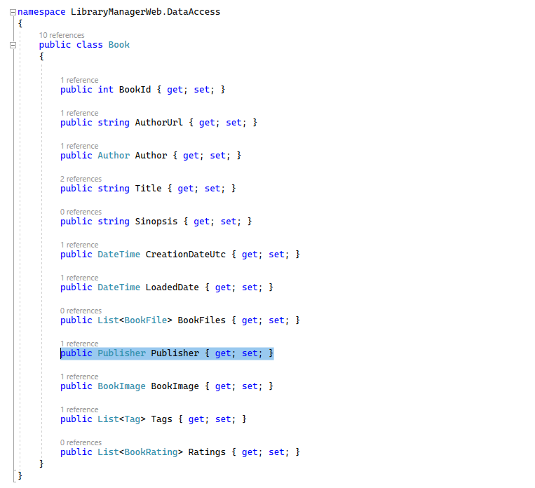
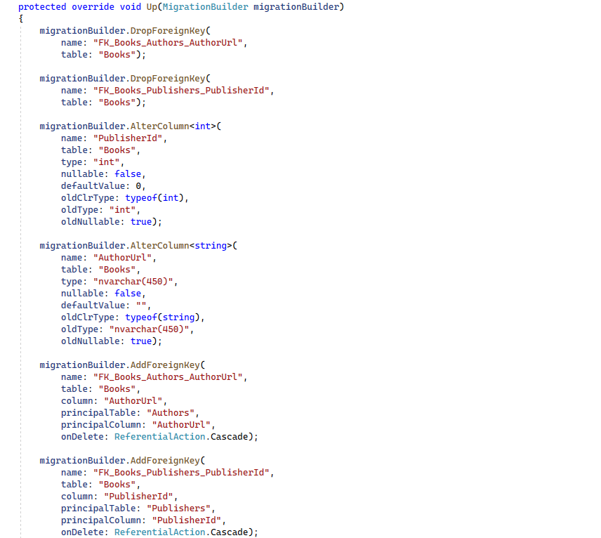

# Configuración manual de las relaciones

Anteriormente ya hemos visto cómo crear relaciones por convención. Ahora vamos a ver cómo hacerlo de forma explícita. Estamos aquí en el proyecto _LibraryManagerWeb_, dentro de la entidad _Book_. En la entidad Book tenemos una relación con la entidad _Publisher_, un libro tiene una editorial y una editorial puede tener n libros.



Esta relación funciona muy bien por convención por el nombre que tiene tanto la propiedad como la entidad. Aun así, vamos a crear la relación explícita utilizando _Fluent API_. Dentro de _EntityConfig_ nos vamos a _BookConfig_.

***./DataAccess/EntityConfig/BookConfig.cs***

```diff
using Microsoft.EntityFrameworkCore;
using Microsoft.EntityFrameworkCore.Metadata.Builders;

using System;
using System.Collections.Generic;
using System.Linq;
using System.Threading.Tasks;

namespace LibraryManagerWeb.DataAccess.EntityConfig
{
 public class BookConfig : IEntityTypeConfiguration<Book>
 {
  public void Configure(EntityTypeBuilder<Book> bookBuilder)
  {
   bookBuilder.HasComment("Tabla para almacenar los libros existentes en esta biblioteca.");
   bookBuilder.HasKey(p => p.BookId);

   bookBuilder.Property(p => p.CreationDateUtc).HasDefaultValueSql("getutcdate()");
   bookBuilder.Ignore(p => p.LoadedDate)
   .Property(p => p.Title).HasMaxLength(300);

   bookBuilder.Property(p => p.Title)
    .UseCollation("SQL_Latin1_General_CP1_CI_AI");

+  bookBuilder.HasOne(p => p.Publisher)

   bookBuilder.HasData(new[]
   {
    new { BookId = 1, AuthorUrl = "stephenking", Title = "Los ojos del dragón", Sinopsis = "El libro \"Los ojos del dragón\".", PublisherId = 1, CreationDateUtc = new DateTime(2021, 1, 1, 0, 0, 0) },
    new { BookId = 2, AuthorUrl= "stephenking", Title = "La torre oscura I", Sinopsis = "Es el libro \"La torre oscura I\"." , PublisherId = 1 , CreationDateUtc = new DateTime(2021, 1, 1, 0, 0, 0) },
    new { BookId = 3, AuthorUrl= "asimov", Title = "Yo, robot", Sinopsis = "Es el libro \"Yo, robot\".\"." , PublisherId = 1 , CreationDateUtc = new DateTime(2021, 1, 1, 0, 0, 0) }
    });
  }
 }
}
```

Hemos empezado a añadir nuestra relación. Lo podríamos haber hecho con _HasMany_ o _HasOne_, dependiendo de si nuestra propiedad de navegación hacia la entidad principal es una sola o una colección. En nuestro caso, un libro tiene una sola editorial, por lo cual sería _HasOne_.

Y ahora vamos a la propiedad inversa, es decir, ¿_Publisher_ tiene una propiedad que vaya hacia libros? No la tiene, pero podemos crearla. Vamos a crearla antes de continuar.

***./DataAccess/Publisher.cs***

```diff
using Microsoft.EntityFrameworkCore;

using System;
using System.Collections.Generic;
using System.Linq;
using System.Threading.Tasks;

namespace LibraryManagerWeb.DataAccess
{
 public class Publisher
 {

  public int PublisherId { get; set; }

  public string Name { get; set; }

+ public List<Book> Books { get; set; }

 }
}

```

Y ahora ya sí, en el extremo de Publisher hacemos _.WithMany_ Es decir, Publisher tiene muchos libros.

***./DataAccess/EntityConfig/BookConfig.cs***

```diff
using Microsoft.EntityFrameworkCore;
using Microsoft.EntityFrameworkCore.Metadata.Builders;

using System;
using System.Collections.Generic;
using System.Linq;
using System.Threading.Tasks;

namespace LibraryManagerWeb.DataAccess.EntityConfig
{
 public class BookConfig : IEntityTypeConfiguration<Book>
 {
  public void Configure(EntityTypeBuilder<Book> bookBuilder)
  {
   bookBuilder.HasComment("Tabla para almacenar los libros existentes en esta biblioteca.");
   bookBuilder.HasKey(p => p.BookId);

   bookBuilder.Property(p => p.CreationDateUtc).HasDefaultValueSql("getutcdate()");
   bookBuilder.Ignore(p => p.LoadedDate)
   .Property(p => p.Title).HasMaxLength(300);

   bookBuilder.Property(p => p.Title)
    .UseCollation("SQL_Latin1_General_CP1_CI_AI");

   bookBuilder.HasOne(p => p.Publisher)
+    .WithMany(p => p.Books)
+    .IsRequired(true);

   bookBuilder.HasData(new[]
   {
    new { BookId = 1, AuthorUrl = "stephenking", Title = "Los ojos del dragón", Sinopsis = "El libro \"Los ojos del dragón\".", PublisherId = 1, CreationDateUtc = new DateTime(2021, 1, 1, 0, 0, 0) },
    new { BookId = 2, AuthorUrl= "stephenking", Title = "La torre oscura I", Sinopsis = "Es el libro \"La torre oscura I\"." , PublisherId = 1 , CreationDateUtc = new DateTime(2021, 1, 1, 0, 0, 0) },
    new { BookId = 3, AuthorUrl= "asimov", Title = "Yo, robot", Sinopsis = "Es el libro \"Yo, robot\".\"." , PublisherId = 1 , CreationDateUtc = new DateTime(2021, 1, 1, 0, 0, 0) }
    });
  }
 }
}
```

Ya tenemos definida nuestra relación y la marcamos como obligatoria.

Ahora bien, imaginemos que en el otro lado de la relación no tenemos ninguna propiedad de navegación. Por ejemplo, en _Books_tenemos una propiedad de navegación que va hacia _Author_. Si entramos en Author, también tenemos aquí una propiedad de navegación inversa que va hacia _Book_. ¿Qué ocurre si la eliminamos? ¿Cómo definimos ahora la relación?

***./DataAccess/Author.cs***

```diff
using Microsoft.EntityFrameworkCore;

using System;
using System.Collections.Generic;
using System.ComponentModel.DataAnnotations;
using System.ComponentModel.DataAnnotations.Schema;
using System.Linq;
using System.Text;
using System.Threading.Tasks;

namespace LibraryManagerWeb.DataAccess
{
 [Comment("Tabla para almacenar los autores que tienen libros en la biblioteca.")]
 public class Author
 {
  public int AuthorId { get; set; }

  public string Name { get; set; }

  public string LastName { get; set; }

  public string DisplayName { get; set; }

  public string AuthorUrl { get; set; }

- public List<Book> Books { get; set; } = new List<Book>();

  public DateTime LoadedDate { get; set; }
 }
}
```

Pues si vamos otra vez a _BookConfig_, podemos hacer _bookBuilder.HasOne_, pero al hacer la relación inversa ¿_WithMany_ de qué? No hay ninguna propiedad de navegación inversa. Podemos utilizar la sobrecarga del método _WithMany_ que no acepta ningún parámetro.

***./DataAccess/EntityConfig/BookConfig.cs***

```diff
using Microsoft.EntityFrameworkCore;
using Microsoft.EntityFrameworkCore.Metadata.Builders;

using System;
using System.Collections.Generic;
using System.Linq;
using System.Threading.Tasks;

namespace LibraryManagerWeb.DataAccess.EntityConfig
{
 public class BookConfig : IEntityTypeConfiguration<Book>
 {
  public void Configure(EntityTypeBuilder<Book> bookBuilder)
  {
   bookBuilder.HasComment("Tabla para almacenar los libros existentes en esta biblioteca.");
   bookBuilder.HasKey(p => p.BookId);

   bookBuilder.Property(p => p.CreationDateUtc).HasDefaultValueSql("getutcdate()");
   bookBuilder.Ignore(p => p.LoadedDate)
   .Property(p => p.Title).HasMaxLength(300);

   bookBuilder.Property(p => p.Title)
    .UseCollation("SQL_Latin1_General_CP1_CI_AI");

   bookBuilder.HasOne(p => p.Publisher)
    .WithMany(p => p.Books);

+  bookBuilder.HasOne(p => p.Author)
+   .WithMany();

   bookBuilder.HasData(new[]
   {
    new { BookId = 1, AuthorUrl = "stephenking", Title = "Los ojos del dragón", Sinopsis = "El libro \"Los ojos del dragón\".", PublisherId = 1, CreationDateUtc = new DateTime(2021, 1, 1, 0, 0, 0) },
    new { BookId = 2, AuthorUrl= "stephenking", Title = "La torre oscura I", Sinopsis = "Es el libro \"La torre oscura I\"." , PublisherId = 1 , CreationDateUtc = new DateTime(2021, 1, 1, 0, 0, 0) },
    new { BookId = 3, AuthorUrl= "asimov", Title = "Yo, robot", Sinopsis = "Es el libro \"Yo, robot\".\"." , PublisherId = 1 , CreationDateUtc = new DateTime(2021, 1, 1, 0, 0, 0) }
    });
  }
 }
}
```

Ahora vamos a ver las claves externas. Por convención, cuando creamos una relación, la clave externa de la entidad dependiente hace referencia a la clave primaria de la entidad principal. Pero esto podríamos sobrescribirlo, de hecho ya lo hemos hecho anteriormente con la clave externa hacia _Author_ desde un libro. Ya no era _AuthorId_, sino que era _AuthorUrl_.


Una relación se puede crear desde dos extremos, desde la parte principal a la secundaria o desde la secundaria a la principal. De hecho nosotros hemos hecho la relación de Author hacia Libros dos veces. No es lo más adecuado, así que ahora borraremos esta para evitar problemas.

***./DataAccess/EntityConfig/BookConfig.cs***

```diff
using Microsoft.EntityFrameworkCore;
using Microsoft.EntityFrameworkCore.Metadata.Builders;

using System;
using System.Collections.Generic;
using System.Linq;
using System.Threading.Tasks;

namespace LibraryManagerWeb.DataAccess.EntityConfig
{
 public class BookConfig : IEntityTypeConfiguration<Book>
 {
  public void Configure(EntityTypeBuilder<Book> bookBuilder)
  {
   bookBuilder.HasComment("Tabla para almacenar los libros existentes en esta biblioteca.");
   bookBuilder.HasKey(p => p.BookId);

   bookBuilder.Property(p => p.CreationDateUtc).HasDefaultValueSql("getutcdate()");
   bookBuilder.Ignore(p => p.LoadedDate)
   .Property(p => p.Title).HasMaxLength(300);

   bookBuilder.Property(p => p.Title)
    .UseCollation("SQL_Latin1_General_CP1_CI_AI");

   bookBuilder.HasOne(p => p.Publisher)
    .WithMany(p => p.Books);

-  bookBuilder.HasOne(p => p.Author)
-   .WithMany();

   bookBuilder.HasData(new[]
   {
    new { BookId = 1, AuthorUrl = "stephenking", Title = "Los ojos del dragón", Sinopsis = "El libro \"Los ojos del dragón\".", PublisherId = 1, CreationDateUtc = new DateTime(2021, 1, 1, 0, 0, 0) },
    new { BookId = 2, AuthorUrl= "stephenking", Title = "La torre oscura I", Sinopsis = "Es el libro \"La torre oscura I\"." , PublisherId = 1 , CreationDateUtc = new DateTime(2021, 1, 1, 0, 0, 0) },
    new { BookId = 3, AuthorUrl= "asimov", Title = "Yo, robot", Sinopsis = "Es el libro \"Yo, robot\".\"." , PublisherId = 1 , CreationDateUtc = new DateTime(2021, 1, 1, 0, 0, 0) }
    });
  }
 }
}
```

Vamos a ir a la configuración de Author. Aquí nos esta marcando un error porque p.Books ya no existe, la hemos borrado. Por lo cual esto habría que cambiarlo.

***./DataAccess/EntityConfig/AuthorConfig.cs***

```diff
using Microsoft.EntityFrameworkCore;
using Microsoft.EntityFrameworkCore.Metadata.Builders;

using System;
using System.Collections.Generic;
using System.Linq;
using System.Threading.Tasks;

namespace LibraryManagerWeb.DataAccess.EntityConfig
{
 public class AuthorConfig : IEntityTypeConfiguration<Author>
 {
  public void Configure(EntityTypeBuilder<Author> authorBuilder)
  {
   authorBuilder.HasIndex(p => new { p.Name, p.LastName });
   authorBuilder.HasKey(p => p.AuthorId);
   authorBuilder.Property(p => p.Name).HasMaxLength(100);
   authorBuilder.Property(p => p.LastName).HasMaxLength(200);
   authorBuilder.Ignore(p => p.LoadedDate);
   authorBuilder.Property(p => p.AuthorId).ValueGeneratedOnAdd();
   authorBuilder.Property(p => p.DisplayName).HasComputedColumnSql("Name + ' ' + LastName", stored: true);
-  authorBuilder.HasMany(p => p.Books)
+  authorBuilder.HasMany<Book>()
    .WithOne(b => b.Author)
    .HasForeignKey(p => p.AuthorUrl)
    .HasPrincipalKey(p => p.AuthorUrl);

   authorBuilder.HasData(new[]
   {
    new Author { AuthorId = 1, Name = "Stephen", LastName = "King", AuthorUrl = "stephenking" },
    new Author { AuthorId = 2, Name = "Isaac", LastName = "Asimov", AuthorUrl = "asimov" }
    });
  }
 }
}
```

Incluso, podemos seguir configurando nuestra relación,  diciéndole si queremos que sea o no obligatoria con _.Required_. Podemos pasarle _true_ o _false_, pero _true_ es por defecto, así que no hace ni falta ponerlo.

***./DataAccess/EntityConfig/AuthorConfig.cs***

```diff
using Microsoft.EntityFrameworkCore;
using Microsoft.EntityFrameworkCore.Metadata.Builders;

using System;
using System.Collections.Generic;
using System.Linq;
using System.Threading.Tasks;

namespace LibraryManagerWeb.DataAccess.EntityConfig
{
 public class AuthorConfig : IEntityTypeConfiguration<Author>
 {
  public void Configure(EntityTypeBuilder<Author> authorBuilder)
  {
   authorBuilder.HasIndex(p => new { p.Name, p.LastName });
   authorBuilder.HasKey(p => p.AuthorId);
   authorBuilder.Property(p => p.Name).HasMaxLength(100);
   authorBuilder.Property(p => p.LastName).HasMaxLength(200);
   authorBuilder.Ignore(p => p.LoadedDate);
   authorBuilder.Property(p => p.AuthorId).ValueGeneratedOnAdd();
   authorBuilder.Property(p => p.DisplayName).HasComputedColumnSql("Name + ' ' + LastName", stored: true);
   authorBuilder.HasMany<Book>()
    .WithOne(b => b.Author)
    .HasForeignKey(p => p.AuthorUrl)
-   .HasPrincipalKey(p => p.AuthorUrl);
+   .HasPrincipalKey(p => p.AuthorUrl)
+   .IsRequired();

   authorBuilder.HasData(new[]
   {
    new Author { AuthorId = 1, Name = "Stephen", LastName = "King", AuthorUrl = "stephenking" },
    new Author { AuthorId = 2, Name = "Isaac", LastName = "Asimov", AuthorUrl = "asimov" }
    });
  }
 }
}
```

Ya tenemos que nuestra relación entre _Author_ y _Book_ es obligatoria.

Vamos a compilar y a generar la migración. En la consola:

```shell
dotnet ef migrations add ExplicitRelations
```

Vamos a ver qué contiene, _Migrations_ y abrimos _ExplicitRelations_. Vamos al método Up. 



Elimina la clave externa de _AuthorUrl_, también la de _PublisherId_. Ahora altera la columna de _PublisherId_ y la convierte a _nullable false_, porque pusimos el _Required_, también altera la propiedad _AuthorUrl_ de Books, para ponerlo con _nullable a false_ támbien y vuelve a crear las _ForeingKeys_. Lo tenemos, utilizando la API Fluida, hemos sido capaces de configurar las relaciones.
