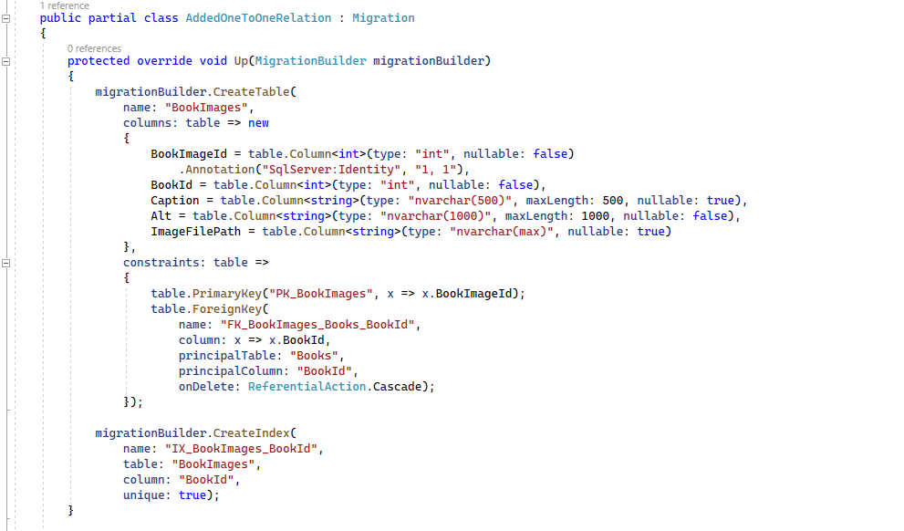

# Relaciones uno a uno

Vamos a ver cómo crear relaciones uno a uno con Entity Framework Core. Estamos en el proyecto de ejemplo _LibraryManagerWeb_ dentro de nuestras entidades y creamos una entidad nueva llamada _BookImage_. Este _BookImage_ tiene una relación de uno a uno con un libro. Un libro tiene una imagen y una imagen solo puede estar asociada a un libro.

***./DataAccess/BookImage.cs***

```csharp
using System;
using System.Collections.Generic;
using System.Linq;
using System.Threading.Tasks;

namespace LibraryManagerWeb.DataAccess
{
 public class BookImage
 {
  public int BookImageId { get; set; }

  public int BookId { get; set; }

  public Book Book { get; set; }

  public string Caption { get; set; }

  public string Alt { get; set; }

  public string ImageFilePath { get; set; }
 }
}

```

Veamos las propiedades de _BookImage_, tiene su BookImageId, BookId que es la clave externa hacia Libros, por lo cual esta es la entidad dependiente y Libros es la principal en esta relación, tenemos la propiedad de navegación de libro, un _Caption_ que es un pie de foto, y una _Alt_ que es el texto alternativo para personas con baja visión o ciegas. _ImageFilePath_ es la ruta en algún tipo de sistema de almacenamiento.

Bien, ¿ahora cómo se relaciona esto con _Books_? Pues dentro de Book, vamos a definir simplemente, la propiedad de navegación inversa.

***./DataAccess/Book.cs***

```diff
using Microsoft.EntityFrameworkCore;

using System;
using System.Collections.Generic;
using System.Linq;
using System.Text;
using System.Threading.Tasks;

namespace LibraryManagerWeb.DataAccess
{
 public class Book
 {

  public int BookId { get; set; }

  public string AuthorUrl { get; set; }

  public Author Author { get; set; }

  public string Title { get; set; }

  public string Sinopsis { get; set; }

  public DateTime CreationDateUtc { get; set; }

  public DateTime LoadedDate { get; set; }

  public List<BookFile> BookFiles { get; set; }

  public Publisher Publisher { get; set; }

+ public BookImage BookImage { get; set; }

  public List<BookRating> Ratings { get; set; }
 }
}

```

Porque esta es la entidad principal. Esta relación podría funcionar perfectamente por convención. Sin embargo, vamos a ver cómo se define directamente en la configuración de la entidad _BookImageConfig_.

***./DataAccess/EntityConfig/BookImageConfig.cs***

```csharp
using Microsoft.EntityFrameworkCore;
using Microsoft.EntityFrameworkCore.Metadata.Builders;

using System;
using System.Collections.Generic;
using System.Linq;
using System.Threading.Tasks;

namespace LibraryManagerWeb.DataAccess.EntityConfig
{
 public class BookImageConfig : IEntityTypeConfiguration<BookImage>
 {
  public void Configure(EntityTypeBuilder<BookImage> bookImageBuilder)
  {
   bookImageBuilder.Property(p => p.Caption).HasMaxLength(500);
   bookImageBuilder.Property(p => p.Alt).HasMaxLength(1000)
    .IsRequired();

   bookImageBuilder.HasOne(p => p.Book)
    .WithOne(p => p.BookImage)
    .IsRequired();

   bookImageBuilder.ToTable("BookImages");

   bookImageBuilder.HasData(new[]
   {
    new BookImage { BookImageId = 1, BookId = 1, ImageFilePath = "img.jpg", Caption = "text", Alt = "Una imagen del libro" }
   });
  }
 }
}

```

Definimos los MaxLength para _Caption_ y para _Alt_. Que la propiedad _Alt_ sea requerida porque el texto alternativo de las imágenes debería ser siempre obligatorio, y por último creamos la realación indicando que una imagen tiene un libro, y un libro tiene también un _BookImage_ usando el método _WithOne_, y además decimos que la relación es obligatoria con _IsRequired_.

Bien, compilamos y vamos a generar la migración.

```shell
dotnet ef migrations add AddedOneToOneRelationship
```

Abrimos la migración para a ver qué se ha añadido.



Crea la tabla de _BookImages_, porque le hemos puesto el nombre correctamente en _.ToTable_ y por último renemos nuestra clave primaria que es _BookImageId_ y una _ForeignKey_ que apunta hacia la tabla de libros. Y, a continuación, inserta los datos en esa tabla.
