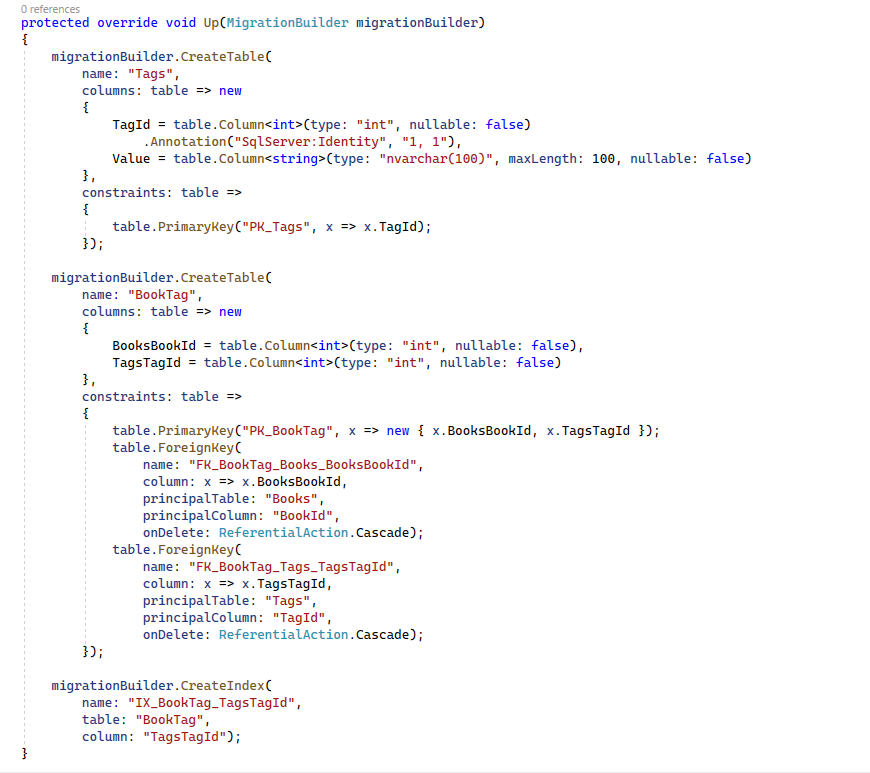

# Relación varios a varios

Desde la versión 5 de Entity Framework Core, crear relaciones _many to many_ es muy sencillo. Vamos a verlo con un ejemplo.

Estamos en el proyecto _LibraryManagerWeb_, y creamos una nueva entidad llamada Tag.

***./DataAccess/Tag.cs***

```csharp
using System;
using System.Collections.Generic;
using System.Linq;
using System.Threading.Tasks;

namespace LibraryManagerWeb.DataAccess
{
 public class Tag
 {

  public int TagId { get; set; }

  public string Value { get; set; }

  public List<Book> Books { get; set; }
 }
}

```

Nuestra idea es añadir etiquetas a los libros. Vamos a ver las propieades de esta entidad: _TagId_, un valor, y por último, una lista de libros donde esta etiqueta puede estar.

Bien, ahora vámonos a _Books_ y añadimos una propiedad de navegación, que es Tag, que también es una lista de Tags por lo cual un libro puede tener muchas etiquetas y una etiqueta puede estar en muchos libros. 

***./DataAccess/Book.cs***

```diff
using Microsoft.EntityFrameworkCore;

using System;
using System.Collections.Generic;
using System.Linq;
using System.Text;
using System.Threading.Tasks;

namespace LibraryManagerWeb.DataAccess
{
 public class Book
 {

  public int BookId { get; set; }

  public string AuthorUrl { get; set; }

  public Author Author { get; set; }

  public string Title { get; set; }

  public string Sinopsis { get; set; }

  public DateTime CreationDateUtc { get; set; }

  public DateTime LoadedDate { get; set; }

  public List<BookFile> BookFiles { get; set; }

  public Publisher Publisher { get; set; }

  public BookImage BookImage { get; set; }

+ public List<Tag> Tags { get; set; }

  public List<BookRating> Ratings { get; set; }
 }
}
```

Por ejemplo, imagínate que creamos la etiqueta _Ciencia Ficción_. No tiene sentido que creemos una etiqueta para cada libro cuando la etiqueta, posiblemente, se utilice en muchas más libros diferentes. Así que hemos hecho esta relación _many to many_.

Anteriormente a Entity Framework Core 5, para hacer esto, teníamos que crear una tabla intermedia, por ejemplo, llamada BookTags y aquí añadir una referencia al libro y una referencia a la etiqueta. Así, con esas dos referencias, hacíamos el _many to many_, porque en cada fila se asociaba una etiqueta con un libro concreto.

Desde la versión 5, eso se puede hacer de forma automática, simplemente, configurando la relación. ¿Dónde se va hacer esto? Pues en la Configuración. ¿De qué entidad? Pues da igual, podemos hacerlo desde cualquiera de los dos lados de la relación.

Vamos a hacerlo, por ejemplo, dentro de _Book_, por lo cual, en _EntityConfig_, vamos a _BookConfig_.

***./DataAccess/EntityConfig/BookConfig.cs***

```diff
using Microsoft.EntityFrameworkCore;
using Microsoft.EntityFrameworkCore.Metadata.Builders;

using System;
using System.Collections.Generic;
using System.Linq;
using System.Threading.Tasks;

namespace LibraryManagerWeb.DataAccess.EntityConfig
{
 public class BookConfig : IEntityTypeConfiguration<Book>
 {
  public void Configure(EntityTypeBuilder<Book> bookBuilder)
  {
   bookBuilder.HasComment("Tabla para almacenar los libros existentes en esta biblioteca.");
   bookBuilder.HasKey(p => p.BookId);

   bookBuilder.Property(p => p.CreationDateUtc).HasDefaultValueSql("getutcdate()");
   bookBuilder.Ignore(p => p.LoadedDate)
   .Property(p => p.Title).HasMaxLength(300);

   bookBuilder.Property(p => p.Title)
    .UseCollation("SQL_Latin1_General_CP1_CI_AI");

   bookBuilder.HasOne(p => p.Publisher)
    .WithMany(p => p.Books)
    .IsRequired();

+  bookBuilder.HasMany(p => p.Tags)
+      .WithMany(p => p.Books);


   bookBuilder.HasData(new[]
   {
    new { BookId = 1, AuthorUrl = "stephenking", Title = "Los ojos del dragón", Sinopsis = "El libro \"Los ojos del dragón\".", PublisherId = 1, CreationDateUtc = new DateTime(2021, 1, 1, 0, 0, 0) },
    new { BookId = 2, AuthorUrl= "stephenking", Title = "La torre oscura I", Sinopsis = "Es el libro \"La torre oscura I\"." , PublisherId = 1 , CreationDateUtc = new DateTime(2021, 1, 1, 0, 0, 0) },
    new { BookId = 3, AuthorUrl= "asimov", Title = "Yo, robot", Sinopsis = "Es el libro \"Yo, robot\".\"." , PublisherId = 1 , CreationDateUtc = new DateTime(2021, 1, 1, 0, 0, 0) }
    });
  }
 }
}
```

Y ya solo con eso, Entity Framework Core va a crear nuestra tabla intermedia. Además, también hemos añadido nuestra tabla de _Tags_ a los _DbSets_ de nuestro contexto. Y así conseguimos que la tabla se llame _Tags_ y no _Tag_. 

***./DataAccess/EntityConfig/TagConfig.cs***

```csharp
using Microsoft.EntityFrameworkCore;
using Microsoft.EntityFrameworkCore.Metadata.Builders;

using System;
using System.Collections.Generic;
using System.Linq;
using System.Threading.Tasks;

namespace LibraryManagerWeb.DataAccess.EntityConfig
{
 public class TagConfig : IEntityTypeConfiguration<Tag>
 {
  public void Configure(EntityTypeBuilder<Tag> tagBuilder)
  {
   tagBuilder.ToTable("Tags");
   tagBuilder.Property(p => p.Value).IsRequired()
    .HasMaxLength(100);
  }
 }
}
```

Compilamos y ahora vamos a generar la migración.

```shell
dotnet ef migrations add AddedManyToManyRelationship
```

Ha creado la migración y vamos a ver al contenido dentro de  _Migrations_. Vamos a fijarnos en _CreateTable Tags_, añade todos sus constraints y demás y luego crea otra tabla _BookTag_. Es nuestra tabla intermedia para poder satisfacer la relación de muchos a muchos. Y dentro hay dos columnas: _Bookld_ y _TagId_.

