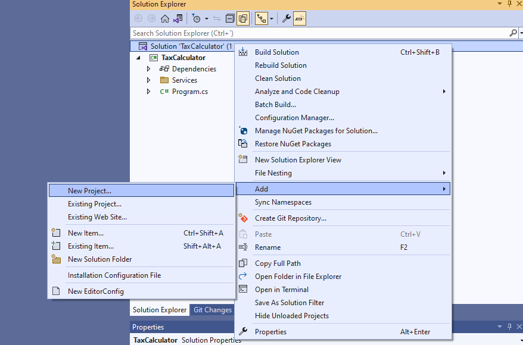
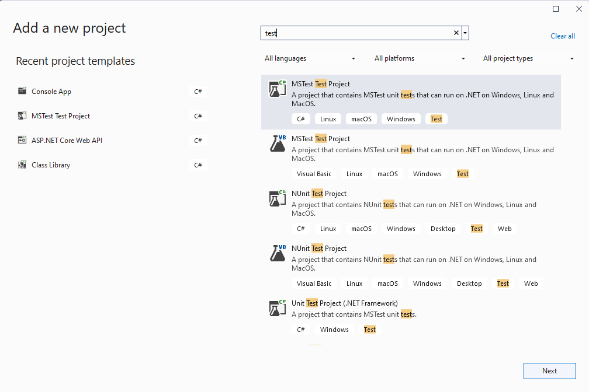
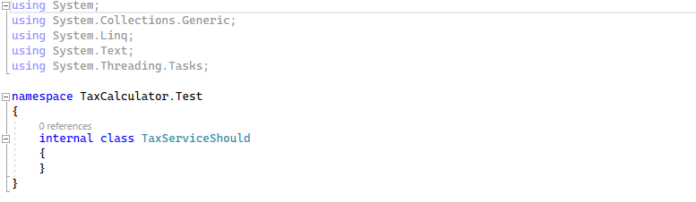
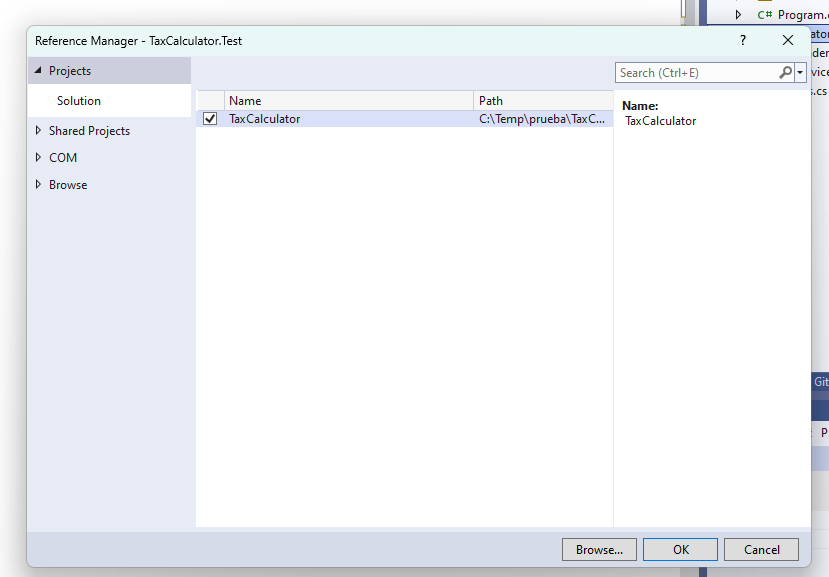
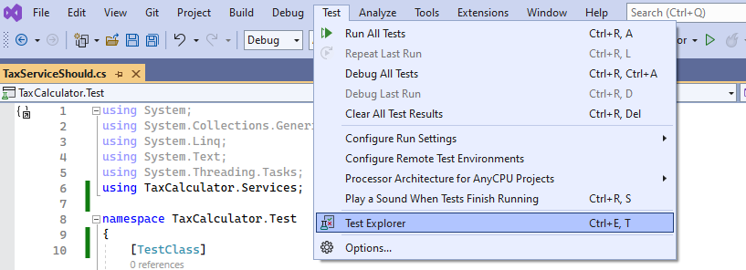
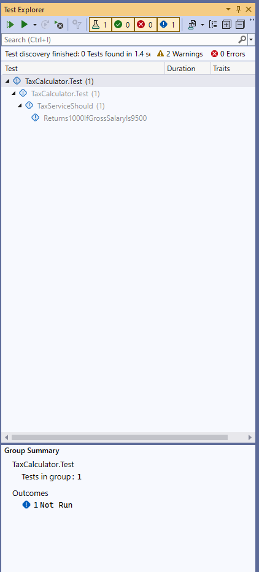
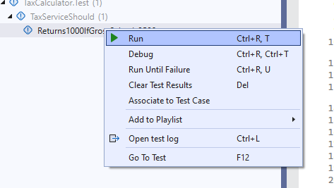
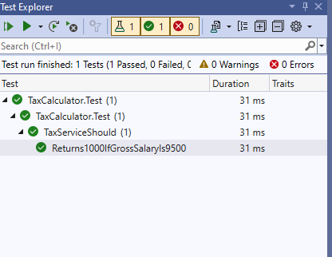
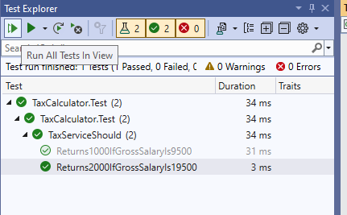
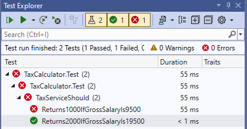

# Nuestro proyecto de test con Visual Studio

Es el momento de crear nuestro primer proyecto de pruebas unitarias, el cual asociaremos al proyecto de ejemplo _TaxCalculator_.

Abrimos el archivo de la solución y vamos a crear este proyecto de test. Pulsamos botón derecho _Add New Project_ y seleccionamos el tipo de test _UnitTestProject_.



Para nuestro primer test vamos a usar MSTest, el framework de test de _Microsoft_ , y como nombre le ponemos _TaxCalculator.Tests._ Por convención, los proyectos de test se nominan poniendo _.Tests_ al final, siempre en referencia al proyecto que vamos a probar. En este caso, estamos probando el proyecto _TaxCalculator_.



Automáticamente, nos ha creado una clase _UnitTest1.cs_ por defecto. Esta clase la vamos a borrar, y vamos a crear nosotros otra clase. Pulsando botón derecho en el proyecto de test, seleccionamos _Add >> New Class_


Hay muchas formas de nominar a los test y las clases de test, pero por convención, vamos a ponerle _TaxServiceShould_.



Tenemos una clase normal, por lo cual ahora vamos a indicar que es una clase de test. Para que el motor de test entienda que esto es un test, tenemos que decorar la clase con el atributo _TestClass_. También tenemos que indicar la clase como pública para que la herramienta _Test Explorer_ pueda localizar el test.

***./TaxCalculator.Test/TaxServiceShould.cs***

```diff
namespace TaxCalculator.Test
{
+   [TestClass]
-    internal class TaxServiceShould
+   public class TaxServiceShould
    {
    }
}
```

Vamos a crear nuestro primer test para cuando le pasemos al servicio, un salario inferior a 10 mil euros. Para ello vamos a creamos un método, con las siguientes consideraciones:

- Para indicar que es un método de test, utilizaremos el decorador _TestMethod_.
- Los métodos de test nunca devuelven nada, por tanto indicamos _void_ como tipo de retorno.
- El nombre siempre por convención, debería ser autoexplicar del caso que vamos a probar, es decir, en este caso: "Devuelve 1000 si el salario es inferior a 10000". Le podemos poner algo así como _Returns1000IfGrossSalaryIs9500_.

***./TaxCalculator.Test/TaxServiceShould.cs***

```diff
namespace TaxCalculator.Test
{
    [TestClass]
    public class TaxServiceShould
    {
+       [TestMethod]
+       public void Returns1000IfGrossSalaryIs9500()
+       {

+       }
    }
}
```

Ahora nos toca completar el test, para ello lo primero que vamos hacer es añadir la referencia al proyecto _TaxCalculator_ al proyecto _TaxCalculator.Test_ para que podamos acceder a nuestro servicio _TaxService_.




Y creamos una instancia del servicio pasandole el valor de prueba y comprobando el resultado generado.

***./TaxCalculator.Test/TaxServiceShould.cs***

```diff
+ using TaxCalculator.Services;

namespace TaxCalculator.Test
{
    [TestClass]
    public class TaxServiceShould
    {
       [TestMethod]
       public void Returns1000IfGrossSalaryIs9500()
       {
+           var taxService = new TaxService();
+           Assert.AreEqual(1000, taxService.GetTax(9500));
       }
    }
}
```

¿Qué es lo que hace el Assert? El Assert es como decirle, "asegurate que esto es lo que debe ocurrir." Es decir, en este caso espera que el test produzca 1000. Si esto se cumple, el test pasará. Si eso no se cumple, el test fallará.

Compilamos la solución y ahora vamos a irnos a la herramienta que tiene _Visual Studio_ para permitirnos ejecutar nuestros test _Test Explorer_.





También podemos usar el atajo de teclado _Ctrl + E, T_. En la ventana de _Test Explorer_ podemos ver el test, en este caso aparece como gris porque nunca se ha ejecutado. Vamos a ejecutar el test, pulsamos botón derecho y hacemos click sobre _Run_.





El test ha pasado, porque el resultado del _Assert_ es el que esperábamos. Vamos a hacer otro método que fuera "Devuelve 2000 si el salario es mayor que 10000".

***./TaxCalculator.Test/TaxServiceShould.cs***

```diff
using TaxCalculator.Services;

namespace TaxCalculator.Test
{
    [TestClass]
    public class TaxServiceShould
    {
       [TestMethod]
       public void Returns1000IfGrossSalaryIs9500()
       {
           var taxService = new TaxService();
           Assert.AreEqual(1000, taxService.GetTax(9500));
       }

+      [TestMethod]
+      public void Returns2000IfGrossSalaryIs19500()
+      {
+          var taxService = new TaxService();
+          Assert.AreEqual(2000, taxService.GetTax(19500));
+      }
    }
}
```

Comprobamos que aparece como No ejecutado en el _Test Explorer_. Lo ejecutamos y vemos que tenemos los dos test en verde como pasados. Tenemos nuestra prueba unitaria para determinar que los dos flujos posibles de ejecución de nuestro proyecto _TaxCalculator_ pasan correctamente.

Vamos a comprobar que pasaría si alguien módifica la lógica de nuestro servicio. Vamos a _TaxCalculator_ y cambiamos el servicio _TaxService_.

***./TaxCalculator/Service/TaxService.cs***

```diff
using System;
using System.Collections.Generic;
using System.Linq;
using System.Text;
using System.Threading.Tasks;

namespace TaxCalculator.Services
{
    public class TaxService
    {

        public decimal GetTax(decimal grossSalary)
        {
-           if (grossSalary < 10000)
+           if (grossSalary < 8000)
            {
                return 1000;
            }
            return 2000;
        }
    }
}
```

Reejecutamos los todos los test Run Selected Tests.



Y comprobamos que ha fallado el primer test porque hemos cambiado el algoritmo que calculaba el impuesto. Así, podemos saber, de forma muy rápida y muy sencilla, una vez hemos creado nuestros test, que nuestro código no está funcionando.

