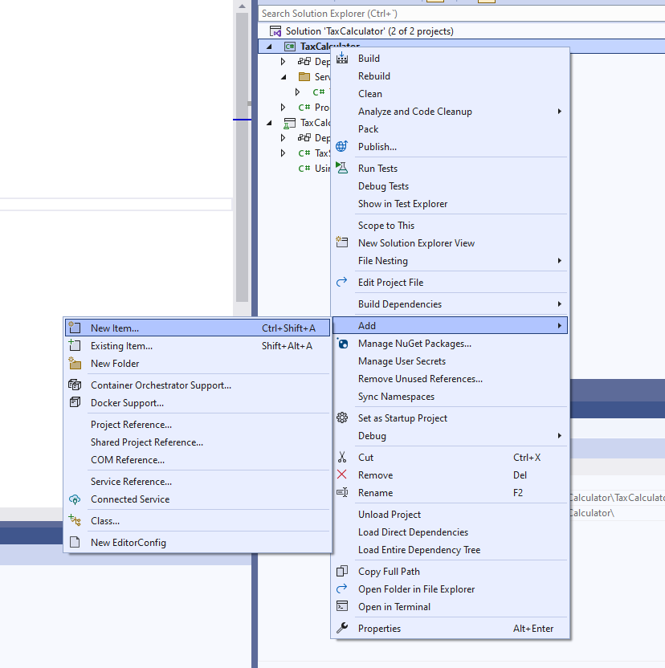
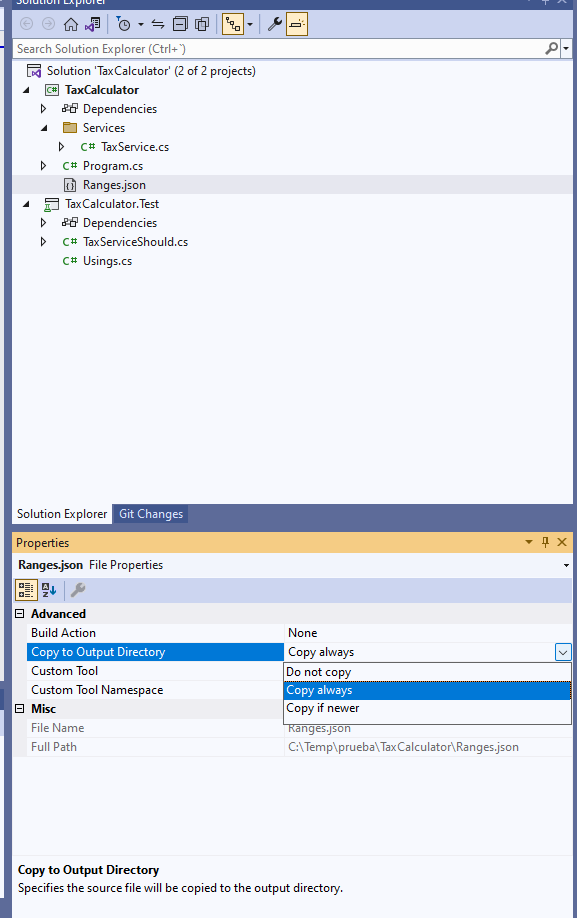
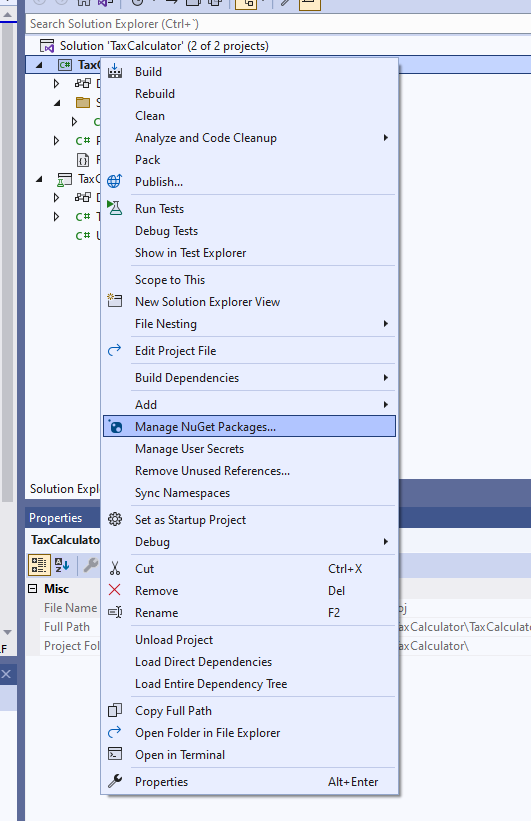
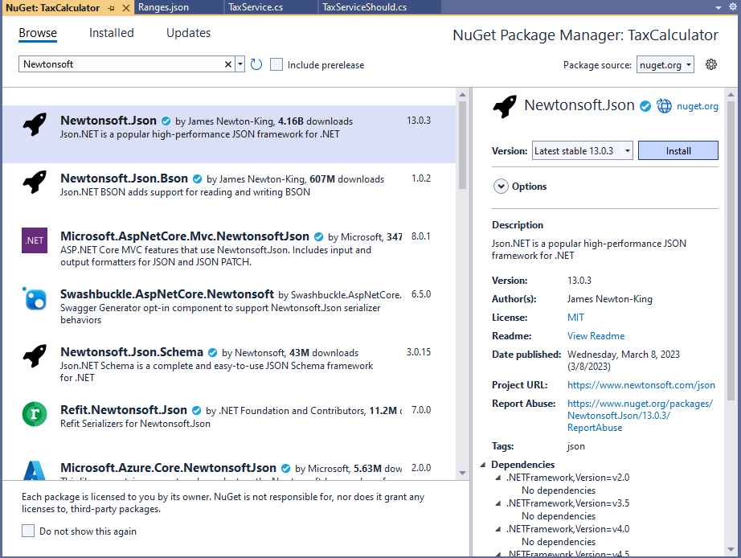
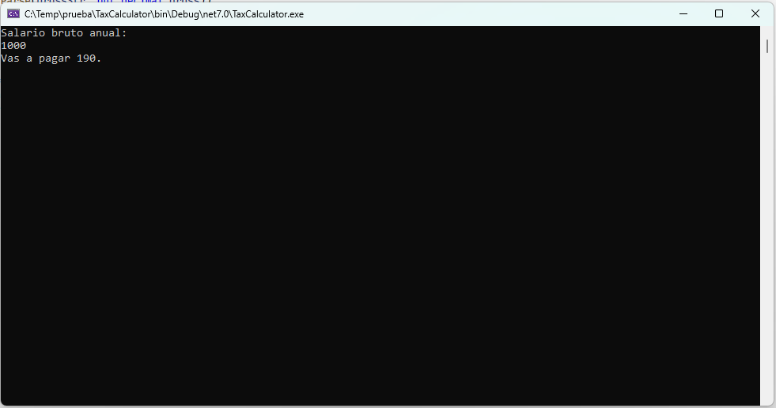

# Tests unitarios y tests de integración

Vamos a ver la diferencia entre un test unitario y un test de integración. Es importante conozcer la diferencia entre estos dos tipos de test, para saber qué se está haciendo exactamente cuando se realiza las pruebas del código.

Como ya sabemos, un test unitario es un test que prueba una pieza pequeña de nuestro código, un método con responsabilidad única dentro de una clase. Sin embargo, un test de integración engloba a más de un sistema, imagínate que el método del servicio que calcula los impuestos, llama a un repositorio que utiliza una base de datos para sacar los rangos salariales de IRPF. En este caso, ya estamos realizando un test de integración, puesto que estamos involucrando a otro sistema, en este caso, a la base de datos.

Para ver esto más claro, vamos a utilizar un ejemplo, abrimos nuestro proyecto _TaxCalculator_. Lo primero que vamos a hacer es crear un fichero JSON con los rangos de IRPF según salario. Para ello, pulsamos botón derecho sobre el proyecto y creamos un nuevo elemento de tipo _JSON_, como nombre le ponemos _Ranges.json_.




Vamos a añadir un array de rangos con su valor mínimo, su valor máximo y su porcentaje a aplicar de impuestos, salvo el último que no tiene valor máximo, ya que un salario que sea mayor de 60 mil siempre va a tributar el 45%.

***./TaxCalculator/Ranges.json***

```json
[
    {
        "inclusiveMinValue": "0",
        "inclusiveMaxValue": "12449",
        "percentage": "19"
    },
    {
        "inclusiveMinValue": "12450",
        "inclusiveMaxValue": "20199",
        "percentage": "24"
    },
    {
        "inclusiveMinValue": "20200",
        "inclusiveMaxValue": "35199",
        "percentage": "30"
    },
    {
        "inclusiveMinValue": "35200",
        "inclusiveMaxValue": "59999",
        "percentage": "37"
    },
    {
        "inclusiveMinValue": "60000",
        "percentage": "45"
    }
]
```

Ahora tenemos que decirle al compilador que ese fichero, _Ranges.json_, se copie a la carpeta de _output_ de nuestra compilación. Por lo cual, seleccionamos el fichero y en la propiedad _Copy to Output_ le decimos _Copy Always_.



El siguiente paso es crear una entidad que va a guardar cada uno de estos rangos. Vamos a crear una carpeta _Entities_ y dentro de dicha carpeta una clase _TaxRange_, esta clase tendrá las tres propiedades de nuestro JSON.

***./TaxCalculator/Entities/TaxRange.cs***

```csharp
using System;
using System.Collections.Generic;
using System.Linq;
using System.Text;
using System.Threading.Tasks;

namespace TaxCalculator.Entities
{
 public class TaxRange
 {

    public decimal InclusiveMinValue { get; set; }

    public decimal? InclusiveMaxValue { get; set; }

    public int Percentage { get; set; }

 }
}
```

El siguiente paso, vamos a crear nuestro repositorio para que nos devuelva los rangos. Primero, vamos a crear una interface que luego implementará nuestro repositorio, ¿Para qué? Porque si queremos seguir utilizando el servicio para hacer pruebas unitarias y tenemos que hacer un mock, es decir, un objeto simulado de ese repositorio. ¿Cuál es la mejor forma? La mejor forma es que el repositorio sea un interface, y esa interface sea la que le pasemos a nuestro servicio, y luego nosotros podamos hacer distintas implementaciones. Por lo cual, podemos hacer un objeto simulado de ese repositorio y seguir haciendo pruebas unitarias con ese servicio.

Creamos una carpeta para guardar las interfaces _Contracts_. Dentro vamos a crear la interface y la llamamos _IRangeRepository_.

***./TaxCalculator/Contracts/IRangeRepository.cs***

```csharp
using TaxCalculator.Entities;

namespace TaxCalculator.Contracts
{
    public interface IRangeRepository
    {
        TaxRange GetRange(decimal grossSalary);
    }
}

```

Antes de continuar, tenemos que instalar un paquete para serializar y deserializar _JSON_. Este paquete se llama _Newtonsoft JSON_. Lo hacemos a través del manejador de NuGets. Pulsamos botón derecho en el proyecto, y seleccioamos _Manage NuGet Packages_.



Buscamos el paquete _Newtonsoft JSON_ e instalamos la última versión estable.



Ahora vamos a crear el repositorio. Creamos una carpeta _Repositories_ para organizarlo, dentro una clase que llamaremos _RangeRepository_.

***./TaxCalculator/Repositories/RangeRepository.cs***

```csharp
using System;
using System.Collections.Generic;
using System.IO;
using System.Linq;
using System.Text;
using System.Threading.Tasks;
using Newtonsoft.Json;
using TaxCalculator.Contracts;
using TaxCalculator.Entities;

namespace TaxCalculator.Repositories
{
    public class RangeRepository : IRangeRepository
    {

        private readonly List<TaxRange> _ranges;

        public RangeRepository()
        {
        string jsonFile = Path.Combine(AppDomain.CurrentDomain.BaseDirectory, "ranges.json");
        _ranges = JsonConvert.DeserializeObject<List<TaxRange>>(File.ReadAllText(jsonFile, Encoding.UTF8));
        }

        public TaxRange GetRange(decimal grossSalary)
        {
        return _ranges.Single(r => grossSalary >= r.InclusiveMinValue && grossSalary <= (r.InclusiveMaxValue ?? grossSalary));
        }
    }
}

```

Ahora vamos a modificar nuestro servicio para que acepte el repositorio y no tenga codificado en su interior los rangos, sino que los saque del repositorio.

***./TaxCalculator/Services/RangeRepository.cs***

```csharp
using System;
using System.Collections.Generic;
using System.Linq;
using System.Text;
using System.Threading.Tasks;
using TaxCalculator.Contracts;

namespace TaxCalculator.Services
{
    public class TaxService
    {
        private readonly IRangeRepository _rangeRepository;

        public TaxService(IRangeRepository rangeRepository)
        {
        _rangeRepository = rangeRepository;
        }

        public decimal GetTax(decimal grossSalary)
        {
        var percentage = _rangeRepository.GetRange(grossSalary).Percentage;
        return grossSalary / 100 * percentage;

        }
    }
}

```

Ahora, tendremos que cambiar el Program.cs porque estamos instanciando el servicio directamente sin pasarle parámetros.

```diff
+   using TaxCalculator.Repositories;
    using TaxCalculator.Services;

    Console.WriteLine("Salario bruto anual:");
    var grossStr = Console.ReadLine();
    if (!Decimal.TryParse(grossStr, out decimal gross))
    {
        Console.WriteLine("No es un valor válido. Pulsa enter para salir.");
        Console.ReadLine();
        return;
    }
-   var taxService = new TaxService();
+   var taxService = new TaxService(new RangeRepository());
    Console.WriteLine($"Vas a pagar {taxService.GetTax(gross)}.");
    Console.ReadLine();
```

Si lo ejecutamos, va a consultar los rangos que están en ese JSON. Vamos a probar con un saldo bruto anual de 1000, el resultado debería ser 190 de impuestos.



Funciona, no hay ningún error. Ahora, vamos a los test de la clase TaxServiceShould, y vamos a modificarlo para que funcione con el nuevo sistema.

***./TaxCalculator.Test/TaxServiceShould.cs***

```diff
using TaxCalculator.Services;
+ using TaxCalculator.Repositories;

namespace TaxCalculator.Test
{
    [TestClass]
    public class TaxServiceShould
    {
-      [TestMethod]
-      public void Returns1000IfGrossSalaryIs9500()
-      {
-          var taxService = new TaxService();
-          Assert.AreEqual(1000, taxService.GetTax(9500));
-      }

-      [TestMethod]
-      public void Returns2000IfGrossSalaryIs19500()
-      {
-          var taxService = new TaxService();
-          Assert.AreEqual(2000, taxService.GetTax(19500));
-      }

+      [TestMethod]
+      public void Returns1805IfGrossSalaryIs9500()
+      {
+          var taxService = new TaxService(new RangeRepository());
+          Assert.AreEqual(1805, taxService.GetTax(9500));
+      }

+      [TestMethod]
+      public void Returns4680IfGrossSalaryIs19500()
+      {
+          var taxService = new TaxService(new RangeRepository());
+          Assert.AreEqual(4680, taxService.GetTax(19500));
+      }

    }
}
```

Hemos cambiado tanto los nombres, porque los tests son diferentes, como la construcción del servicio, porque ahora acepta un respositorio de tipo _RangeRepository_. Compilamos y ejecutamos todos los test con la herramienta _Test Explorer_, y vemos que han pasado los dos, están en verde.


De este modo, hemos convertido dos tests unitarios en dos test de integración, puesto que ahora estamos involucrando a dos sistemas: el método y el respositorio que utiliza la base de datos. Si quisiéramos volver a convertir esto en un test unitario, deberíamos de crear una clase que implemente la interface _IRangeRepository_ esa clase, utilizar un método creado por nosotros con un valor esperado, y pasarle esa interface al servicio. De este modo, volveríamos a tener un sistema totalmente independiente y determinista.
