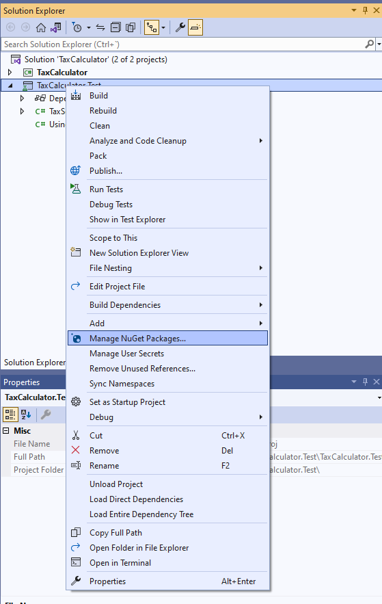
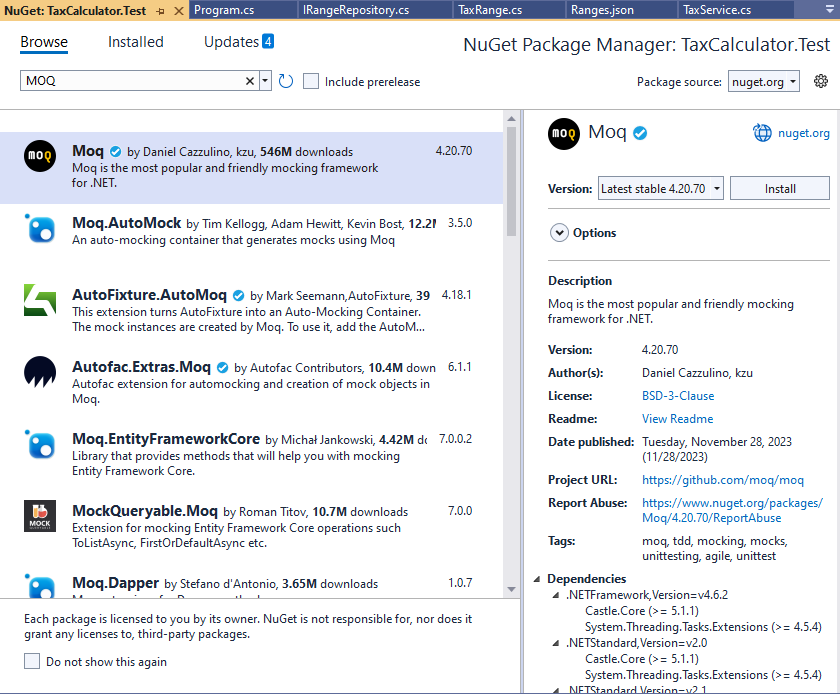
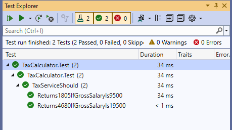

# Mocking

En el ejemplo anterior, vimos que los test se habian convertido en test de integración porque ya no solo proban el funcionamiento de un método. En el test intervenia un elemento externo que nos devolvía un resultado que no podemos controlar. ¿Cómo podriamos simular ese comportamiento para que el elemento externo nos devuelva un resultado deseado? Tenemos dos opciones:

- Creando una clase que implemente la interfaz y que siempre nos devuelva un mismo resultado al llamar al metodo _GetRange_.
- Usar una libreria de _Mock_ que se comporte de la forma que deseemos en cada momento.

Vamos a ver que es eso de _Mock_. Una Librería de Mock es una librería que nos permite emular interfase o clases de forma muy sencilla. En caso de emular una clase, la Librería de Mock va a ser capaz de sobrescribir su comportamiento por un comportamiento que nosotros mismos codifiquemos dentro del mock. En ese proyecto, vamos a utilizar una de las librerías más conocidas llamada _MOQ_.





Ahora vamos a modificar nuestros test para usar el _Moq_ en vez del repositorio que tira de la base de datos.

```diff
using TaxCalculator.Services;
- using TaxCalculator.Repositories;
+ using Moq;
+ using TaxCalculator.Contracts;
+ using TaxCalculator.Entities;

namespace TaxCalculator.Test
{
    [TestClass]
    public class TaxServiceShould
    {
       [TestMethod]
       public void Returns1805IfGrossSalaryIs9500()
       {
+          var mock = new Mock<IRangeRepository>();
+          mock.Setup(taxService => taxService.GetRange(9500)).Returns(new TaxRange()
+          {
+              InclusiveMinValue = 0,
+              InclusiveMaxValue = 12449,
+              Percentage = 19
+          });

-          var taxService = new TaxService(new RangeRepository());
+          var taxService = new TaxService(mock.Object);
           Assert.AreEqual(1805, taxService.GetTax(9500));
       }

       [TestMethod]
       public void Returns4680IfGrossSalaryIs19500()
       {
+          var mock = new Mock<IRangeRepository>();
+          mock.Setup(taxService => taxService.GetRange(19500)).Returns(new TaxRange()
+          {
+               InclusiveMinValue = 12450,
+               InclusiveMaxValue = 20199,
+               Percentage = 24
+          });

-          var taxService = new TaxService(new RangeRepository());
+          var taxService = new TaxService(mock.Object);
           Assert.AreEqual(4680, taxService.GetTax(19500));
       }

    }
}
```

Vamos a ejecutar los tests con la herramienta de _Test Explorer_.



Ya tenemos los tests en verde. ¿Qué hemos conseguido? Hemos conseguido hacer una prueba unitaria de un servicio con una dependencia externa y hemos simulado esa dependencia externa utilizando una librería de mock, haciendo un setup del método al que llama el servicio y diciéndole que devuelva una lambda que nosotros mismos hemos construido utilizando una lista de resultados cerrados. Este método es muy utilizado cuando el servicio que tiene la dependencia no recibela interfase, sino que recibe una clase pero como hemos visto, a veces hay problemas cuando el método a sobrescribir no es virtual.
