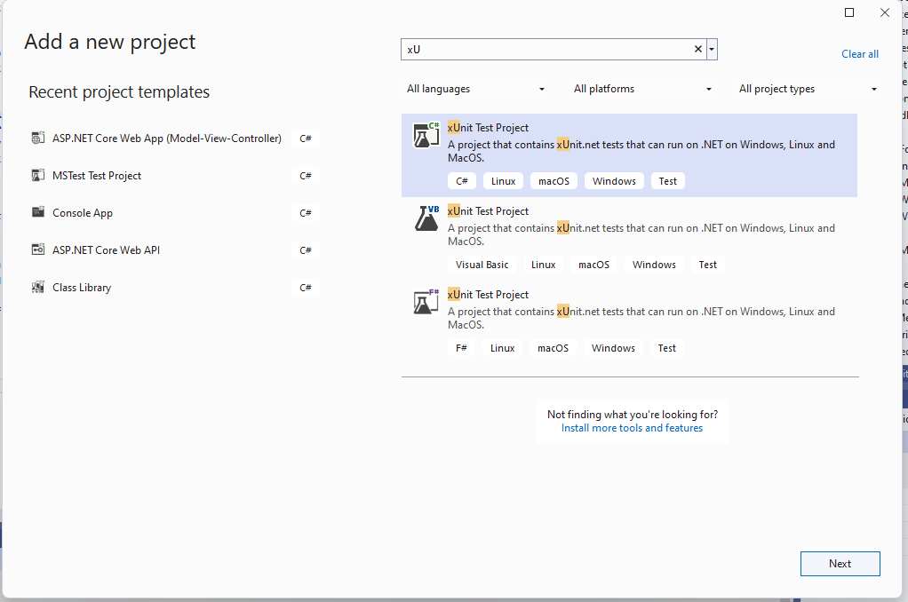
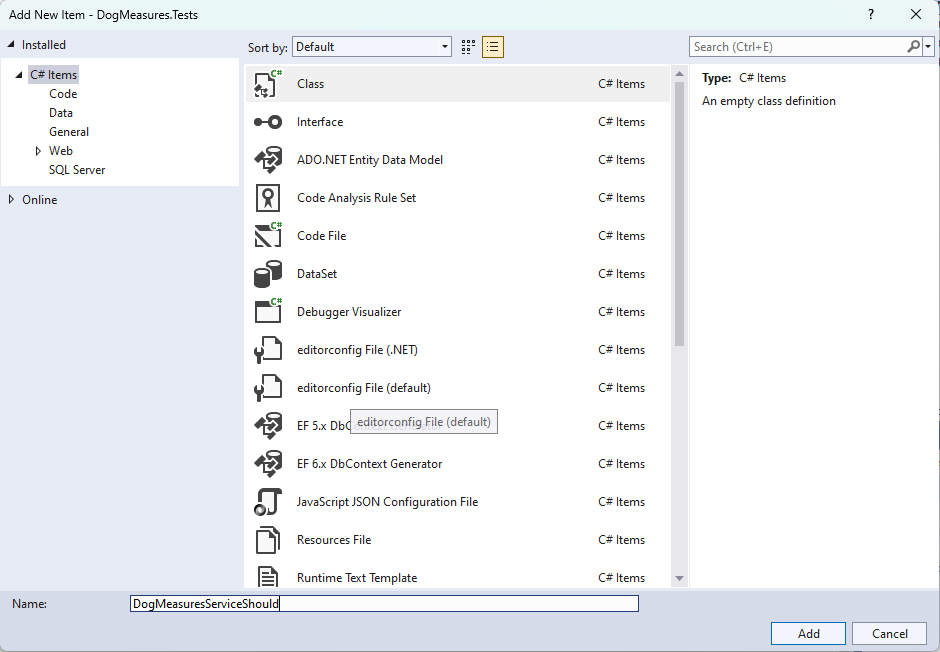
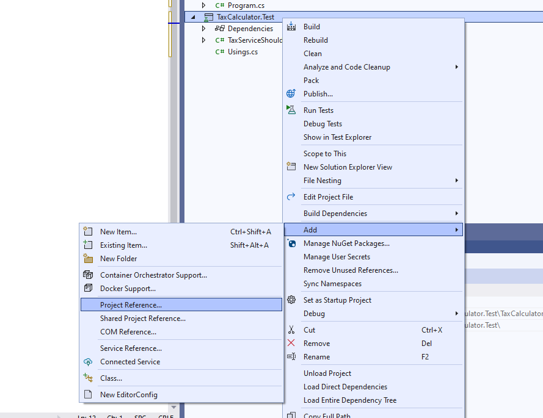
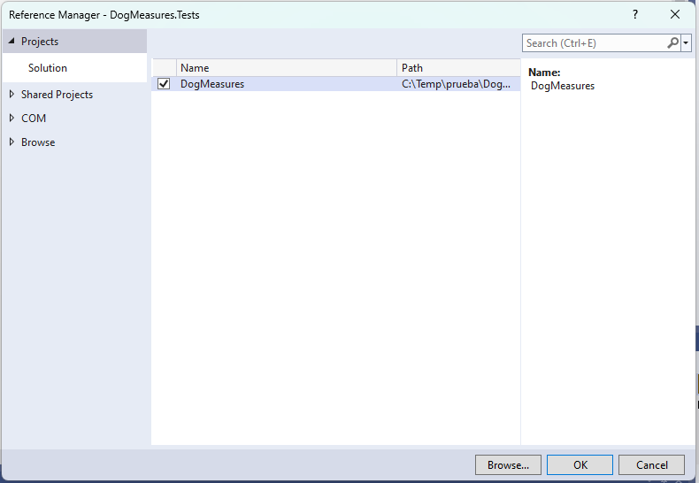
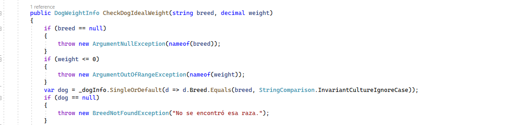
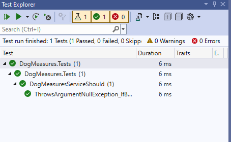
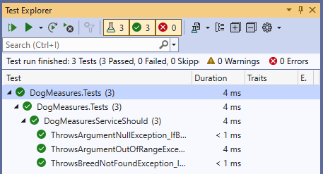
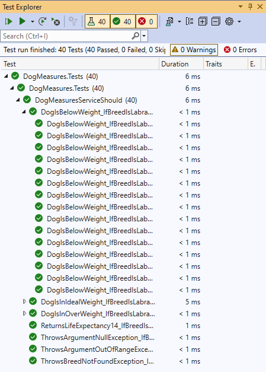

# Proyecto de test con XUnit

Vamos a ver cómo utilizar el framework de test _xUnit_. Este _framework_ también se integra perfectamente con el _Test Runner_ de _Visual Studio_, pudiendo manejar todos nuestros test desde el _Test Explorer_.

Para ver esto, vamos a utilizar un ejemplo que puedes encontrar en la carpeta raiz _02-otros-frameworks-para-test_, se trata del proyecto _DogMeasures_. Este proyecto tiene un servicio al que se le pasa a una raza de un perro y un peso, y nos devolverá si ese perro está en su peso ideal, por debajo de él o por encima de él. Nuestra idea es hacer pruebas unitarias para ese servicio.

Para ello, vamos a crear nuestro proyecto de test utilizando el framework _xUnit_. Pulsamos botón derecho en la solución y en _Add New Project_.


Vamos a buscar en plantilla de tipo _.NET Core_, puesto que este proyecto está basado en _ASP.Net Core MVC_ y seleccionamos  _xUnit Test Project_. Le ponemos de nombre _DogMeasures.Tests_.



Vamos a borramos la clase _UnitTest1_ que nos crea por defecto. Ahora, vamos a crear nuestra clase para probar el servicio. Añadimos una clase, que llamaremos _DogMeasuresServiceShould_.



Vamos a cambiar la clase a _public_.

***./DogMeasures.Tests/DogMeasuresServiceShould***

```diff
namespace DogMeasures.Tests
{
-   internal class DogMeasuresServiceShould
+   public class DogMeasuresServiceShould
    {
    }
}
```

Al contrario que con _MSTest_, aquí no necesitamos decorar nuestra clase con ningún tipo de atributo. Igualmente, para instanciar nuestro servicio, no necesitamos tampoco crear ningún atributo especial, sino que se hace directamente en el constructor de la clase.

Vamos a añadir la referencia al proyecto _DogMeasures_ para que podamos tener acceso al servicio desde el proyecto de test.





Ahora vamos a crear el constructor.

***./DogMeasures.Tests/DogMeasuresServiceShould***

```diff
namespace DogMeasures.Tests
{
    public class DogMeasuresServiceShould
    {
+       private DogMeasuresService _dogMeasuresService;

+       public DogMeasuresServiceShould()
+       {
+           _dogMeasuresService = new DogMeasuresService();
+       }
    }
}
```

Ahora vamos a codificar nuestra primera prueba. En el método _CheckDogIdealWeight_, que es el que nos va a devolver si el perro está en su peso o no, hay varias comprobaciones, vamos a verlas. Navegamos al servicio _DogMeasuresService_ y vamos al método.



Se comprueba si:

- La raze es nula, en ese caso se va a devolver un _ArgumentNullException_.
- El peso es negativo, en ese caso se va a devolver un _OutOfRange_.
- La raza no se encuentra, en ese caso se va a devolver un _BreedNotFoundException_.

Podemos codificar las pruebas para chequear estos casos. En xUnit hay dos tipos de test, _fact_ y _theory_. Con _fact_, nuestro test pasará si la condición se cumple. Sin embargo, con _theory_ tenemos un conjunto de varios datos, y se ejecutará el test por cada uno de esos datos, devolviéndonos si ha pasado o no.

En el primer, solo vamos a evaluar si lanza la excepción de _ArgumentNullException_ cuando breed es nulo, por lo cual vamos a utilizar un _fact_.

***./DogMeasures.Tests/DogMeasuresServiceShould***

```diff
namespace DogMeasures.Tests
{
    public class DogMeasuresServiceShould
    {
        private DogMeasuresService _dogMeasuresService;

        public DogMeasuresServiceShould()
        {
            _dogMeasuresService = new DogMeasuresService();
        }

+       [Fact]
+       public void ThrowsArgumentNullException_IfBreedIsNull()
+       {
+           Assert.Throws<ArgumentNullException>(() => _dogMeasuresService.CheckDogIdealWeight(null, 0));
+       }
    }
}
```

Compilamos. Y ejecutamos los test en el _Test Explorer_. Y vemos que nuestro test ha pasado.



Podemos hacer exactamente lo mismo con las otras dos excepciones _BreedNotFoundException_ y con _OutOfRangeException_.

***./DogMeasures.Tests/DogMeasuresServiceShould***

```diff
namespace DogMeasures.Tests
{
    public class DogMeasuresServiceShould
    {
        private DogMeasuresService _dogMeasuresService;

        public DogMeasuresServiceShould()
        {
            _dogMeasuresService = new DogMeasuresService();
        }

        [Fact]
        public void ThrowsArgumentNullException_IfBreedIsNull()
        {
            Assert.Throws<ArgumentNullException>(() => _dogMeasuresService.CheckDogIdealWeight(null, 0));
        }

+       [Fact]
+       public void ThrowsBreedNotFoundException_IfBreedIsSamoyedo()
+       {
+           Assert.Throws<BreedNotFoundException>(() => _dogMeasuresService.CheckDogIdealWeight("samoyedo", 20));
+       }

+       [Fact]
+       public void ThrowsArgumentOutOfRangeException_IfLengthIsNegative()
+       {
+           Assert.Throws<ArgumentOutOfRangeException>(() => _dogMeasuresService.CheckDogIdealWeight("bóxer", -5));
+       }
    }
}
```

Veamos si pasa los test.



Ahora vamos a trabajar con _theory_. _Theory_ nos permite trabajar con varios datos en un mismo test. Vamos a ejecuta el test tantas veces como datos aparezcan en _Inline_, pasándole estos valores como weight.

***./DogMeasures.Tests/DogMeasuresServiceShould***

```diff
namespace DogMeasures.Tests
{
    public class DogMeasuresServiceShould
    {
        private DogMeasuresService _dogMeasuresService;

        public DogMeasuresServiceShould()
        {
            _dogMeasuresService = new DogMeasuresService();
        }

        [Fact]
        public void ThrowsArgumentNullException_IfBreedIsNull()
        {
            Assert.Throws<ArgumentNullException>(() => _dogMeasuresService.CheckDogIdealWeight(null, 0));
        }

        [Fact]
        public void ThrowsBreedNotFoundException_IfBreedIsSamoyedo()
        {
            Assert.Throws<BreedNotFoundException>(() => _dogMeasuresService.CheckDogIdealWeight("samoyedo", 20));
        }

        [Fact]
        public void ThrowsArgumentOutOfRangeException_IfLengthIsNegative()
        {
            Assert.Throws<ArgumentOutOfRangeException>(() => _dogMeasuresService.CheckDogIdealWeight("bóxer", -5));
        }

+       [InlineData(20)]
+       [InlineData(21)]
+       [InlineData(22)]
+       [InlineData(23)]
+       [InlineData(24)]
+       [InlineData(25)]
+       [InlineData(26)]
+       [InlineData(27)]
+       [InlineData(28)]
+       [InlineData(29)]
+       [InlineData(30)]
+       [InlineData(31)]
+       [InlineData(32)]
+       [InlineData(33)]
+       [InlineData(34)]
+       [InlineData(35)]
+       [Theory]
+       public void DogIsInIdealWeight_IfBreedIsLabradorAndWeightInRange20And35(int weight)
+       {
+           var result = _dogMeasuresService.CheckDogIdealWeight("Labrador retriever", weight);
+           Assert.True(result.DeviationType == Models.DogWeightInfo.WeightDeviationType.InRange);
+           Assert.Equal(0, result.WeightDeviation);
+       }
    }
}
```

Debería pasar si en ese rango el perro "Labrador retriever" está en su peso ideal, y además si la desviación de peso es cero.

En el siguiente test vamos a comprobar valores por debajo del peso ideal.

***./DogMeasures.Tests/DogMeasuresServiceShould***

```diff
namespace DogMeasures.Tests
{
    public class DogMeasuresServiceShould
    {
        private DogMeasuresService _dogMeasuresService;

        public DogMeasuresServiceShould()
        {
            _dogMeasuresService = new DogMeasuresService();
        }

        [Fact]
        public void ThrowsArgumentNullException_IfBreedIsNull()
        {
            Assert.Throws<ArgumentNullException>(() => _dogMeasuresService.CheckDogIdealWeight(null, 0));
        }

        [Fact]
        public void ThrowsBreedNotFoundException_IfBreedIsSamoyedo()
        {
            Assert.Throws<BreedNotFoundException>(() => _dogMeasuresService.CheckDogIdealWeight("samoyedo", 20));
        }

        [Fact]
        public void ThrowsArgumentOutOfRangeException_IfLengthIsNegative()
        {
            Assert.Throws<ArgumentOutOfRangeException>(() => _dogMeasuresService.CheckDogIdealWeight("bóxer", -5));
        }

        [InlineData(20)]
        [InlineData(21)]
        [InlineData(22)]
        [InlineData(23)]
        [InlineData(24)]
        [InlineData(25)]
        [InlineData(26)]
        [InlineData(27)]
        [InlineData(28)]
        [InlineData(29)]
        [InlineData(30)]
        [InlineData(31)]
        [InlineData(32)]
        [InlineData(33)]
        [InlineData(34)]
        [InlineData(35)]
        [Theory]
        public void DogIsInIdealWeight_IfBreedIsLabradorAndWeightInRange20And35(int weight)
        {
            var result = _dogMeasuresService.CheckDogIdealWeight("Labrador retriever", weight);
            Assert.True(result.DeviationType == Models.DogWeightInfo.WeightDeviationType.InRange);
            Assert.Equal(0, result.WeightDeviation);
        }

+       [InlineData(5)]
+       [InlineData(6)]
+       [InlineData(7)]
+       [InlineData(8)]
+       [InlineData(9)]
+       [InlineData(10)]
+       [InlineData(11)]
+       [InlineData(12)]
+       [InlineData(13)]
+       [InlineData(14)]
+       [InlineData(15)]
+       [InlineData(16)]
+       [InlineData(17)]
+       [InlineData(18)]
+       [InlineData(19)]
+       [Theory]
+       public void DogIsBelowWeight_IfBreedIsLabradorAndWeightInRange5And19(int weight)
+       {
+           var result = _dogMeasuresService.CheckDogIdealWeight("Labrador retriever", weight);
+           Assert.True(result.DeviationType == Models.DogWeightInfo.WeightDeviationType.BelowWeight);
+           Assert.Equal(20 - weight, result.WeightDeviation);
+       }
    }
}
```

Y, vamos a hacer un test para comprobar el sobrepeso, cuando el peso tiene un valor de 36 a 40.

***./DogMeasures.Tests/DogMeasuresServiceShould***

```diff
namespace DogMeasures.Tests
{
    public class DogMeasuresServiceShould
    {
        private DogMeasuresService _dogMeasuresService;

        public DogMeasuresServiceShould()
        {
            _dogMeasuresService = new DogMeasuresService();
        }

        [Fact]
        public void ThrowsArgumentNullException_IfBreedIsNull()
        {
            Assert.Throws<ArgumentNullException>(() => _dogMeasuresService.CheckDogIdealWeight(null, 0));
        }

        [Fact]
        public void ThrowsBreedNotFoundException_IfBreedIsSamoyedo()
        {
            Assert.Throws<BreedNotFoundException>(() => _dogMeasuresService.CheckDogIdealWeight("samoyedo", 20));
        }

        [Fact]
        public void ThrowsArgumentOutOfRangeException_IfLengthIsNegative()
        {
            Assert.Throws<ArgumentOutOfRangeException>(() => _dogMeasuresService.CheckDogIdealWeight("bóxer", -5));
        }

        [InlineData(20)]
        [InlineData(21)]
        [InlineData(22)]
        [InlineData(23)]
        [InlineData(24)]
        [InlineData(25)]
        [InlineData(26)]
        [InlineData(27)]
        [InlineData(28)]
        [InlineData(29)]
        [InlineData(30)]
        [InlineData(31)]
        [InlineData(32)]
        [InlineData(33)]
        [InlineData(34)]
        [InlineData(35)]
        [Theory]
        public void DogIsInIdealWeight_IfBreedIsLabradorAndWeightInRange20And35(int weight)
        {
            var result = _dogMeasuresService.CheckDogIdealWeight("Labrador retriever", weight);
            Assert.True(result.DeviationType == Models.DogWeightInfo.WeightDeviationType.InRange);
            Assert.Equal(0, result.WeightDeviation);
        }

        [InlineData(5)]
        [InlineData(6)]
        [InlineData(7)]
        [InlineData(8)]
        [InlineData(9)]
        [InlineData(10)]
        [InlineData(11)]
        [InlineData(12)]
        [InlineData(13)]
        [InlineData(14)]
        [InlineData(15)]
        [InlineData(16)]
        [InlineData(17)]
        [InlineData(18)]
        [InlineData(19)]
        [Theory]
        public void DogIsBelowWeight_IfBreedIsLabradorAndWeightInRange5And19(int weight)
        {
            var result = _dogMeasuresService.CheckDogIdealWeight("Labrador retriever", weight);
            Assert.True(result.DeviationType == Models.DogWeightInfo.WeightDeviationType.BelowWeight);
            Assert.Equal(20 - weight, result.WeightDeviation);
        }

+       [InlineData(36)]
+       [InlineData(37)]
+       [InlineData(38)]
+       [InlineData(39)]
+       [InlineData(40)]
+       [Theory]
+       public void DogIsInOverWeight_IfBreedIsLabradorAndWeightInRange36And40(int weight)
+       {
+           var result = _dogMeasuresService.CheckDogIdealWeight("Labrador retriever", weight);
+           Assert.True(result.DeviationType == Models.DogWeightInfo.WeightDeviationType.Overweight);
+           Assert.Equal(weight - 35, result.WeightDeviation);
+       }
    }
}
```

Por último, queremos hacer un test que simplemente determine si se está cumpliendo con la esperanza de vida esperada para esta raza, que es 14.

***./DogMeasures.Tests/DogMeasuresServiceShould***

```diff
namespace DogMeasures.Tests
{
    public class DogMeasuresServiceShould
    {
        private DogMeasuresService _dogMeasuresService;

        public DogMeasuresServiceShould()
        {
            _dogMeasuresService = new DogMeasuresService();
        }

        [Fact]
        public void ThrowsArgumentNullException_IfBreedIsNull()
        {
            Assert.Throws<ArgumentNullException>(() => _dogMeasuresService.CheckDogIdealWeight(null, 0));
        }

        [Fact]
        public void ThrowsBreedNotFoundException_IfBreedIsSamoyedo()
        {
            Assert.Throws<BreedNotFoundException>(() => _dogMeasuresService.CheckDogIdealWeight("samoyedo", 20));
        }

        [Fact]
        public void ThrowsArgumentOutOfRangeException_IfLengthIsNegative()
        {
            Assert.Throws<ArgumentOutOfRangeException>(() => _dogMeasuresService.CheckDogIdealWeight("bóxer", -5));
        }

        [InlineData(20)]
        [InlineData(21)]
        [InlineData(22)]
        [InlineData(23)]
        [InlineData(24)]
        [InlineData(25)]
        [InlineData(26)]
        [InlineData(27)]
        [InlineData(28)]
        [InlineData(29)]
        [InlineData(30)]
        [InlineData(31)]
        [InlineData(32)]
        [InlineData(33)]
        [InlineData(34)]
        [InlineData(35)]
        [Theory]
        public void DogIsInIdealWeight_IfBreedIsLabradorAndWeightInRange20And35(int weight)
        {
            var result = _dogMeasuresService.CheckDogIdealWeight("Labrador retriever", weight);
            Assert.True(result.DeviationType == Models.DogWeightInfo.WeightDeviationType.InRange);
            Assert.Equal(0, result.WeightDeviation);
        }

        [InlineData(5)]
        [InlineData(6)]
        [InlineData(7)]
        [InlineData(8)]
        [InlineData(9)]
        [InlineData(10)]
        [InlineData(11)]
        [InlineData(12)]
        [InlineData(13)]
        [InlineData(14)]
        [InlineData(15)]
        [InlineData(16)]
        [InlineData(17)]
        [InlineData(18)]
        [InlineData(19)]
        [Theory]
        public void DogIsBelowWeight_IfBreedIsLabradorAndWeightInRange5And19(int weight)
        {
            var result = _dogMeasuresService.CheckDogIdealWeight("Labrador retriever", weight);
            Assert.True(result.DeviationType == Models.DogWeightInfo.WeightDeviationType.BelowWeight);
            Assert.Equal(20 - weight, result.WeightDeviation);
        }

        [InlineData(36)]
        [InlineData(37)]
        [InlineData(38)]
        [InlineData(39)]
        [InlineData(40)]
        [Theory]
        public void DogIsInOverWeight_IfBreedIsLabradorAndWeightInRange36And40(int weight)
        {
            var result = _dogMeasuresService.CheckDogIdealWeight("Labrador retriever", weight);
            Assert.True(result.DeviationType == Models.DogWeightInfo.WeightDeviationType.Overweight);
            Assert.Equal(weight - 35, result.WeightDeviation);
        }

+       [Fact]
+       public void ReturnsLifeExpectancy14_IfBreedIsLabrador()
+       {
+           Assert.Equal(14, _dogMeasuresService.GetLifeExpectancy("Labrador retriever"));
+       }
    }
}
```

Ejecutamos todos los test en el _Test Explorer_. Y vemos que han pasado todos los test.



Como ves, el Test Explorer nos está mostrando un test por cada conjunto de datos del atributo _Inline_. ¿Qué hemos conseguido con esto? Hemos conseguido probar que con labrador y, por lo tanto, con cualquier raza, ya que el algoritmo es el mismo, en los rangos definidos, el algoritmo devuelve los datos que tiene que devolver.
