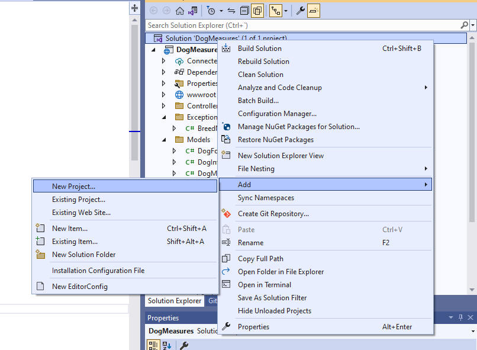
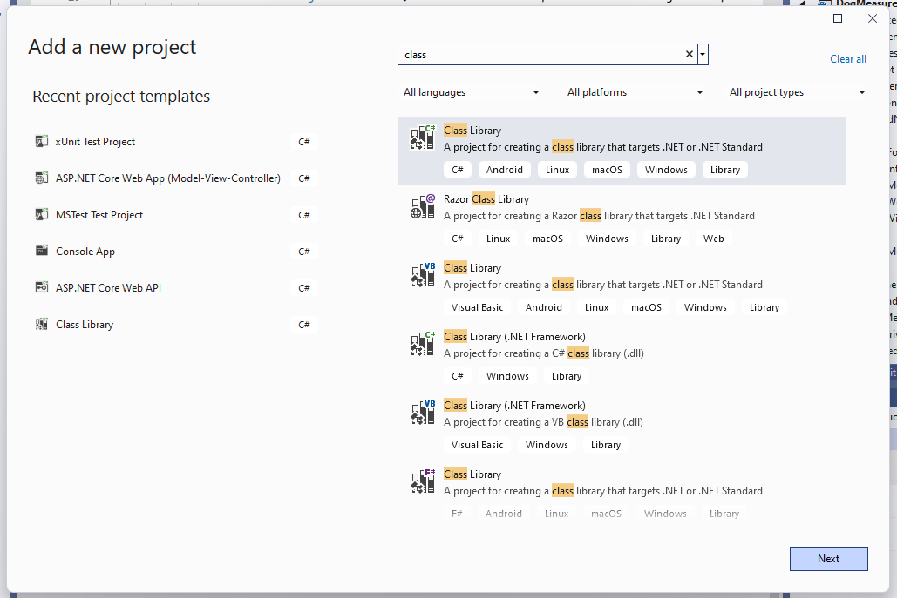
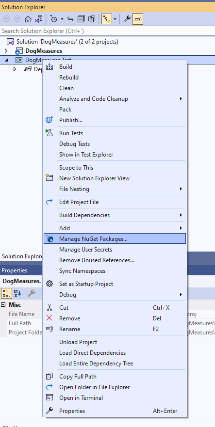
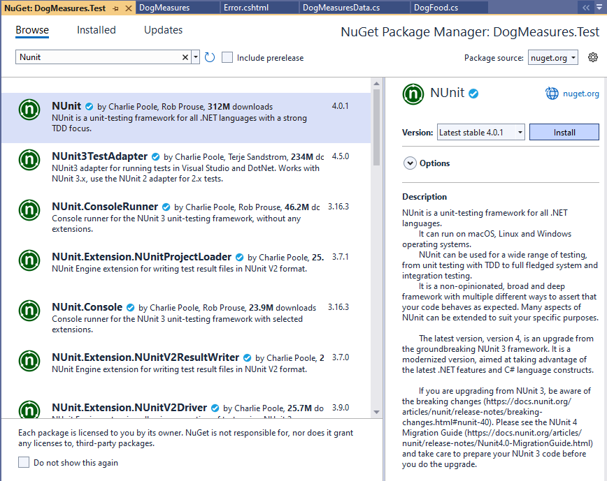
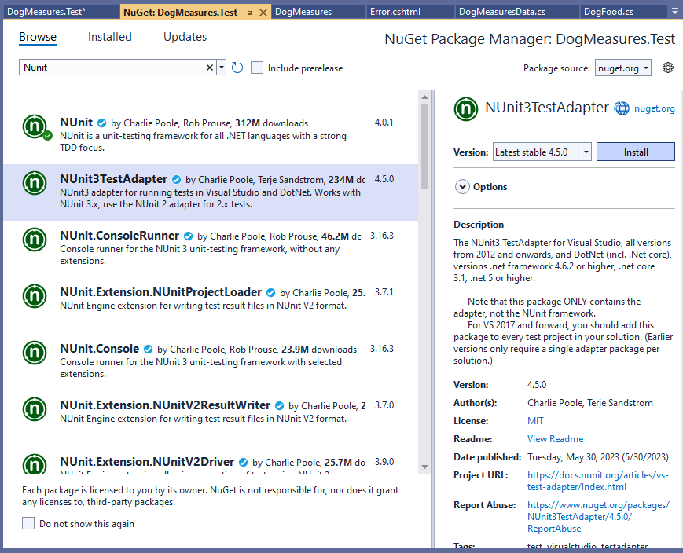
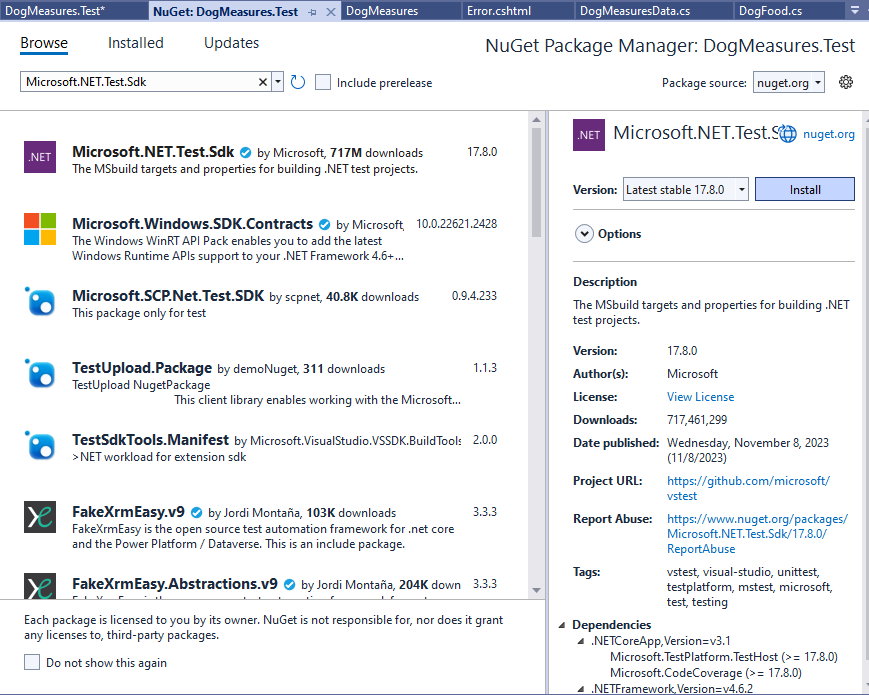
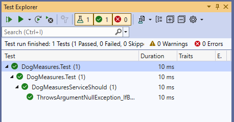
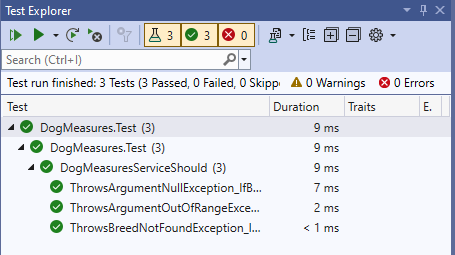
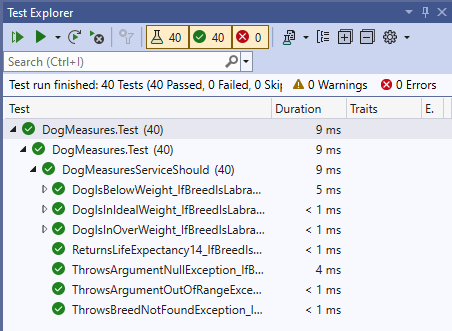

# Proyecto de test con NUnit

Ahora vamos a trabajar con otro framework de test muy conocido llamado _NUnit_. _NUnit_ también se integra con el test runner de _Visual Studio_, aunque, en este caso, no tiene una plantilla de creación de proyecto por defecto, por lo cual tendremos que crear un proyecto _Class Library_ e instalar algunos paquetes _NuGet_.

Vamos a partir del proyecto de ejemplo que ya hemos usado anteriormente _DogMeasures_. Este proyecto tiene un servicio al que se le pasa la raza y el peso de un perro y nos devuelve si el perro está en su peso ideal o no lo está. Vamos a hacer un proyecto de Test para probar este servicio. Pulsamos botón derecho en la solución y seleccionamos _Add New Project_.



Deberá ser .NET Core, y usar la plantilla de _Class Library_, porque, en este caso, no hay plantilla por defecto para _NUnit_. Le ponemos el nombre _DogMeasures.Test_.



Y ahora borramos la clase que nos crea por defecto _Class1_. Vamos a comenzar a instalar los paquetes para integrar _NUnit_ con el test runner de _Visual Studio_ y convertir este proyecto de _Class Library_ en un proyecto de Test. Pulsamos notón derecho sobre el proyecto y vamos a la opción _Manage NuGet Packages_.



En el campo _search_ escribimos _Nunit_, e instalamos la última versión estable.



El siguiente paquete es _NUnit3TestAdapter_, pulsamos _Install_ y aceptamos la licencia.



Por último, tenemos que instalar el paquete _Microsoft.NET.Test.Sdk_.



Ya podemos crear nuestra clase para probar el servicio _DogMeasure Services_. Pulsamos botón derecho en nuestro proyecto de test y seleccioamos _Add item_, del tipo _Class_. Como nombre le pondremos _DogMeasuresServiceShould_.


La ponemos como pública.

***./DogMeasures.Tests/DogMeasuresServiceShould***

```diff
namespace DogMeasures.Tests
{
-   internal class DogMeasuresServiceShould
+   public class DogMeasuresServiceShould
    {
    }
}
```

Y aquí, para que el motor de Test sepa que esto es una clase de Test, la decoramos con el atributo _TestFixture_.

***./DogMeasures.Tests/DogMeasuresServiceShould***

```diff
+ using NUnit.Framework;

namespace DogMeasures.Tests
{
+   [TestFixture]
    public class DogMeasuresServiceShould
    {
    }
}
```

Vamos a añadir la referencia al proyecto _DogMeasures_ para que podamos tener acceso al servicio desde el proyecto de test.


Ahora, lo que tenemos que hacer es instanciar nuestro servicio a probar. Para ello, vamos a utilizar un atributo llamado _OneTimeSetUp_. Al trabajar con _NUnit_, tenemos dos atributos que decorando un método harán que ese método se ejecute, o bien al inicio de un conjunto de Test, o bien antes de ejecutar cada Test que sería el decorador _SetUp_.

En este caso, con _OneTimeSetUp_ hacemos que el método decorado por ese atributo se ejecute solo una vez al iniciar el conjunto de Test.

***./DogMeasures.Tests/DogMeasuresServiceShould***

```diff
+ using DogMeasures.Services;
using NUnit.Framework;

namespace DogMeasures.Tests
{
    [TestFixture]
    public class DogMeasuresServiceShould
    {
+       private DogMeasuresService _dogMeasuresService;

+       [OneTimeSetUp]
+       public void Setup()
+       {
+           _dogMeasuresService = new DogMeasuresService();
+       }
    }
}
```

Con esto ya podemos utilizar esta variable en cualquiera de nuestros tests, ya que, en el momento en que se ejecute alguno, antes se habrá ejecutado previamente este método. Pero, recuerda, solo una vez. Si quisiéramos que el método se ejecutara antes de cada test cambiaríamos el [OneTimeSetUp] por [SetUp].

Vamos a hacer ahora nuestra primera prueba. Se trata de ver si realmente cuando al servicio le pasamos _null_ en la raza del perro, va a lanzar una excepción de tipo _ArgumentNullException_. Para crear un test vamos a decorar el método con el atributo _Test_.

***./DogMeasures.Tests/DogMeasuresServiceShould***

```diff
using DogMeasures.Services;
using NUnit.Framework;

namespace DogMeasures.Tests
{
    [TestFixture]
    public class DogMeasuresServiceShould
    {
        private DogMeasuresService _dogMeasuresService;

        [OneTimeSetUp]
        public void Setup()
        {
            _dogMeasuresService = new DogMeasuresService();
        }

+       [Test]
+       public void ThrowsArgumentNullException_IfBreedIsNull()
+       {
+           Assert.Throws<ArgumentNullException>(() => _dogMeasuresService.CheckDogIdealWeight(null, 5));
+       }        
    }
}
```

Compilamos y ejecutamos el test para ver que ha pasado sin problemas.



Vamos a hacer un par de métodos de prueba más. Creamos uno para ver si está lanzando el _BreedNotFoundException_ cuando le estamos pasando una raza que no existe en la base de datos, y otro de _ArgumentOutOfRange_ cuando le estamos pasando un peso negativo.

***./DogMeasures.Tests/DogMeasuresServiceShould***

```diff
using DogMeasures.Services;
using NUnit.Framework;

namespace DogMeasures.Tests
{
    [TestFixture]
    public class DogMeasuresServiceShould
    {
        private DogMeasuresService _dogMeasuresService;

        [OneTimeSetUp]
        public void Setup()
        {
            _dogMeasuresService = new DogMeasuresService();
        }

        [Test]
        public void ThrowsArgumentNullException_IfBreedIsNull()
        {
            Assert.Throws<ArgumentNullException>(() => _dogMeasuresService.CheckDogIdealWeight(null, 5));
        }  

+       [Test]
+       public void ThrowsBreedNotFoundException_IfBreedIsSamoyedo()
+       {
+           Assert.Throws<BreedNotFoundException>(() => _dogMeasuresService.CheckDogIdealWeight("samoyedo", 20));
+       }      

+       [Test]
+       public void ThrowsArgumentOutOfRangeException_IfLengthIsNegative()
+       {
+           Assert.Throws<ArgumentOutOfRangeException>(() => _dogMeasuresService.CheckDogIdealWeight("bóxer", -5));
+       }
    }
}
```

Compilamos y ejecutamos los test. Resultados: los tres test han pasado.



Por último, vamos a hacer test de prueba de datos. Vamos a hacer un test para ver si realmente está devolviéndonos que nuestro perro está en el peso ideal si le pasamos el rango adecuado, otro para ver si está bajo el peso ideal y otro para ver si está sobre el peso ideal.

***./DogMeasures.Tests/DogMeasuresServiceShould***

```diff
using DogMeasures.Services;
using NUnit.Framework;

namespace DogMeasures.Tests
{
    [TestFixture]
    public class DogMeasuresServiceShould
    {
        private DogMeasuresService _dogMeasuresService;

        [OneTimeSetUp]
        public void Setup()
        {
            _dogMeasuresService = new DogMeasuresService();
        }

        [Test]
        public void ThrowsArgumentNullException_IfBreedIsNull()
        {
            Assert.Throws<ArgumentNullException>(() => _dogMeasuresService.CheckDogIdealWeight(null, 5));
        }  

        [Test]
        public void ThrowsBreedNotFoundException_IfBreedIsSamoyedo()
        {
            Assert.Throws<BreedNotFoundException>(() => _dogMeasuresService.CheckDogIdealWeight("samoyedo", 20));
        }      

        [Test]
        public void ThrowsArgumentOutOfRangeException_IfLengthIsNegative()
        {
            Assert.Throws<ArgumentOutOfRangeException>(() => _dogMeasuresService.CheckDogIdealWeight("bóxer", -5));
        }

+       [Test]
+       public void DogIsInIdealWeight_IfBreedIsLabradorAndWeightInRange20And35([Range(20, 35)]int weight)
+       {
+           var result = _dogMeasuresService.CheckDogIdealWeight("Labrador retriever", weight);
+           Assert.That(result.DeviationType == Models.DogWeightInfo.WeightDeviationType.InRange);
+           Assert.That(result.WeightDeviation == 0);
+       }

+       [Test]
+       public void DogIsBelowWeight_IfBreedIsLabradorAndWeightInRange5And19([Range(5, 19)]int weight)
+       {
+           var result = _dogMeasuresService.CheckDogIdealWeight("Labrador retriever", weight);
+           Assert.That(result.DeviationType == Models.DogWeightInfo.WeightDeviationType.BelowWeight);
+           Assert.That(result.WeightDeviation == 20 - weight);
+       }


+       [Test]
+       public void DogIsInOverWeight_IfBreedIsLabradorAndWeightInRange36And40([Range(36, 40)]int weight)
+       {
+           var result = _dogMeasuresService.CheckDogIdealWeight("Labrador retriever", weight);
+           Assert.That(result.DeviationType == Models.DogWeightInfo.WeightDeviationType.Overweight);
+           Assert.That(result.WeightDeviation == weight - 35);
+       }
    }
}
```

Vamos a hacer otro test, que es para calcular si realmente la esperanza de vida que nos está devolviendo es la correcta.

***./DogMeasures.Tests/DogMeasuresServiceShould***

```diff
using DogMeasures.Services;
using NUnit.Framework;

namespace DogMeasures.Tests
{
    [TestFixture]
    public class DogMeasuresServiceShould
    {
        private DogMeasuresService _dogMeasuresService;

        [OneTimeSetUp]
        public void Setup()
        {
            _dogMeasuresService = new DogMeasuresService();
        }

        [Test]
        public void ThrowsArgumentNullException_IfBreedIsNull()
        {
            Assert.Throws<ArgumentNullException>(() => _dogMeasuresService.CheckDogIdealWeight(null, 5));
        }  

        [Test]
        public void ThrowsBreedNotFoundException_IfBreedIsSamoyedo()
        {
            Assert.Throws<BreedNotFoundException>(() => _dogMeasuresService.CheckDogIdealWeight("samoyedo", 20));
        }      

        [Test]
        public void ThrowsArgumentOutOfRangeException_IfLengthIsNegative()
        {
            Assert.Throws<ArgumentOutOfRangeException>(() => _dogMeasuresService.CheckDogIdealWeight("bóxer", -5));
        }

        [Test]
        public void DogIsInIdealWeight_IfBreedIsLabradorAndWeightInRange20And35([Range(20, 35)]int weight)
        {
            var result = _dogMeasuresService.CheckDogIdealWeight("Labrador retriever", weight);
            Assert.That(result.DeviationType == Models.DogWeightInfo.WeightDeviationType.InRange);
            Assert.That(result.WeightDeviation == 0);
        }

        [Test]
        public void DogIsBelowWeight_IfBreedIsLabradorAndWeightInRange5And19([Range(5, 19)]int weight)
        {
            var result = _dogMeasuresService.CheckDogIdealWeight("Labrador retriever", weight);
            Assert.That(result.DeviationType == Models.DogWeightInfo.WeightDeviationType.BelowWeight);
            Assert.That(result.WeightDeviation == 20 - weight);
        }


        [Test]
        public void DogIsInOverWeight_IfBreedIsLabradorAndWeightInRange36And40([Range(36, 40)]int weight)
        {
            var result = _dogMeasuresService.CheckDogIdealWeight("Labrador retriever", weight);
            Assert.That(result.DeviationType == Models.DogWeightInfo.WeightDeviationType.Overweight);
            Assert.That(result.WeightDeviation == weight - 35);
        }

+       [Test]
+       public void ReturnsLifeExpectancy14_IfBreedIsLabrador()
+       {
+           Assert.That(_dogMeasuresService.GetLifeExpectancy("Labrador retriever") == 14);
+       }
    }
}
```

Compilamos y ejecutamos nuestros tests.



Han pasado todos nuestros tests, y fíjate cómo va generando todas las llamadas según los rangos que hemos definidos. Con esto, hemos conseguido de forma muy sencilla probar los métodos del servicio _DogMeasuresServices_, y además, con el atributo _Range_, hemos conseguido probar rangos de datos sin tener que crear muchos métodos de Test y, además, de una forma muy elegante, simplemente con una línea de código en el propio método de Test.
