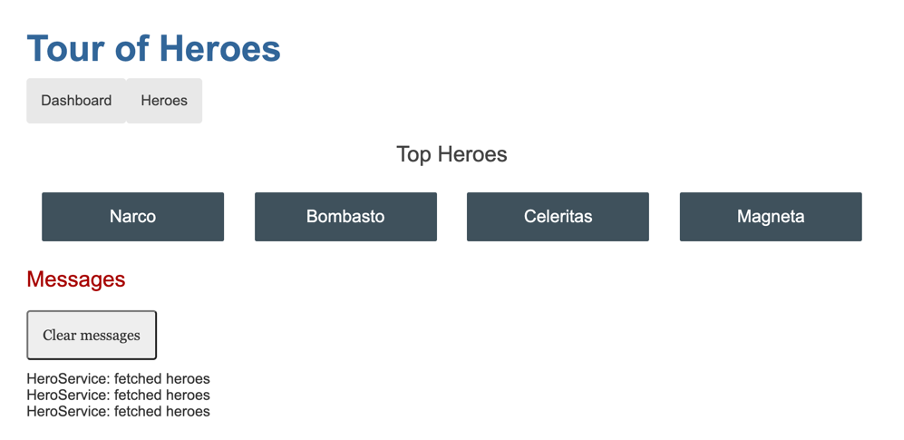

# Introducción a la demo

Para no perder el tiempo con una aplicación creada desde cero, y que además tengamos todas las partes que necesitamos para entender todo lo que te ofrece Microsoft Azure, vamos a utilizar el front-end del tutorial de Angular Tour of Heroes, con unas ligeras modificaciones 😙



 Si quieres generarlo por tu cuenta desde cero los pasos aquí: [https://angular.io/tutorial/tour-of-heroes](https://angular.io/tutorial/tour-of-heroes), pero no te hará falta para esta clase. El resultado del mismo puedes encontrarlo en [01-stack-relacional/03-cloud/azure/01-depliegue-de-tu-primera-app/front-end](front-end/).

Para comprobar que funciona correctamente lanza los siguientes comandos:

```bash
cd front-end
npm install
npm start
```

Este tutorial termina con una API en memoria como parte de la solución, pero nosotros queremos que sea una API real y que se conecte a una base de datos real. 

Por ello, para el backend, he creado una API en .NET Core, utilizando Entity Framework, y que se apoya en un SQL Server, que devolverá los héroes y nos permitirá manipularlos. Para ello he utilizado este otro tutorial para crear APIs en .NET donde está orientado a una lista de TODOs y yo simplemente lo he cambiado a la lista de héroes que necesitamos: https://docs.microsoft.com/es-es/aspnet/core/tutorials/first-web-api?view=aspnetcore-5.0&tabs=visual-studio-code 

El resultado final lo puedes encontrar en la carpeta back-end de este repositorio.

Para que esta API pueda funcionar necesitarás además de una base de datos SQL Server. Como venimos de una clase de Docker en tres horas 😙 y sabemos que podemos utilizar un contenedor para hospedar la misma vamos a crearlo con el siguiente comando:

```bash
docker run \
--name sqlserver \
-e 'ACCEPT_EULA=1' \
-e 'MSSQL_SA_PASSWORD=Password1!' \
 -v mssqlserver_volume:/var/opt/mssql \
-p 1433:1433 \
-d mcr.microsoft.com/azure-sql-edge
```
Ahora entra en el directorio `back-end` y ejecuta la API:

```bash
cd back-end
dotnet run
```

Si todo ha ido bien, deberías poder acceder a la API en `https://localhost:5001/api/hero` y verás que te devolverá un JSON vacío, ya que todavía no hemos añadido ningún héroe.

Para añadir algunos y que veas que la aplicación funciona puedes utilizar el archivo `client.http` que encontrarás en la carpeta `back-end` y que puedes ejecutar con la extensión de Visual Studio Code `REST Client`.

Ahora que ya tienes todas las piezas necesarias para la demo, vamos a desplegarlas en Azure.

## Instalación de Azure CLI

Para poder desplegar nuestra aplicación en Azure necesitamos instalar Azure CLI. Puedes encontrar las instrucciones para tu sistema operativo en la siguiente URL: [https://docs.microsoft.com/es-es/cli/azure/install-azure-cli](https://docs.microsoft.com/es-es/cli/azure/install-azure-cli)

Una vez lo tengas el siguiente paso es iniciar sesión en Azure con el siguiente comando:

```bash
az login
```

## Configura tus variables de entorno

Para que sea más sencillo modificar el nombre que le des a las cosas, utiliza las siguientes variables de entorno:

```bash
# Generales
RESOURCE_GROUP=tour-of-heroes
LOCATION=westeurope

# Base de datos
SQL_SERVER_NAME=tour-of-heroes-sql
SQL_SERVER_USERNAME=sqladmin
SQL_SERVER_PASSWORD=Password1!

# Backend
BACK_END_NAME=tour-of-heroes-api

# Front-end
FRONT_END_NAME=tour-of-heroes-web
```

## Creación de un grupo de recursos

Todo lo que despleguemos en Azure debe estar dentro de un grupo de recursos. Para crear uno nuevo ejecuta el siguiente comando:

```bash
az group create --name $RESOURCE_GROUP --location $LOCATION
```

Ahora ya tienes un sitio donde desplegar los diferentes componentes.

## Despliegue de la base de datos

Para poder desplegar la base de datos donde se almacenarán los héroes primero necesitas un servidor de SQL Server. En el caso de Azure dispones de un servicio llamado Azure SQL que es el que vamos a utilizar.

Para crear un servidor de SQL Server ejecuta el siguiente comando:

```bash
az sql server create \
--name $SQL_SERVER_NAME \
--resource-group $RESOURCE_GROUP \
--location $LOCATION \
--admin-user $SQL_SERVER_USERNAME \
--admin-password $SQL_SERVER_PASSWORD
```

Para este ejemplo no te hace falta nada más, ya que la base de datos se creará de forma automática dentro de este cuando arranquemos la API con la nueva cadena de conexión.

La misma tendrá esta forma: 

```bash
echo "Server=$SQL_SERVER_NAME.database.windows.net,1433;Initial Catalog=heroes;Persist Security Info=False;User ID=$SQL_SERVER_USERNAME;Password=$SQL_SERVER_PASSWORD;Encrypt=False"
```
Reemplaza la misma en el archivo de configuración `appsettings.Development.json` que encontrarás en la carpeta `back-end` de este repositorio.

Si ahora vuelves a acceder a la API te darás cuenta de que te encuentras con un error parecido al siguiente:

`SqlException: Cannot open server 'tour-of-heroes-sql' requested by the login. Client with IP address 'XX.XXX.XXX.XXX' is not allowed to access the server. To enable access, use the Azure Management Portal or run sp_set_firewall_rule on the master database to create a firewall rule for this IP address or address range. It may take up to five minutes for this change to take effect.`

Esto es debido a que Azure SQL Server tiene un firewall que por defecto no permite el acceso a nadie. Para solucionar esto necesitas añadir una regla de firewall que permita el acceso a tu IP. Puedes hacerlo con el siguiente comando:

```bash
az sql server firewall-rule create \
--resource-group $RESOURCE_GROUP \
--server $SQL_SERVER_NAME \
--name AllowYourIp \
--start-ip-address $(curl ifconfig.me) \
--end-ip-address $(curl ifconfig.me)
```
Si ahora vuelves a acceder a la API verás que ya no te da ningún error y que puedes añadir héroes a la base de datos, de la misma forma que lo hiciste con la que tienes ejecutándose en Docker.

Hurray 🎉! Ya tienes la base de datos desplegada en Azure. Ahora solo nos quedan las otras dos partes 😎

## Despliegue del back-end

Para desplegar el back-end necesitas un servicio de App Service. Este servicio te permite desplegar aplicaciones web, APIs, y funciones en la nube.

Para crear un App Service ejecuta el siguiente comando:

```bash
az appservice plan create \
--name $BACK_END_NAME \
--resource-group $RESOURCE_GROUP \
--location $LOCATION \
--sku F1
```

Pero este solo es el Plan de App Service, ahora necesitas crear el App Service en sí. Para ello ejecuta el siguiente comando:

```bash
az webapp create \
--name $BACK_END_NAME \
--resource-group $RESOURCE_GROUP \
--plan $BACK_END_NAME \
--runtime "dotnet:8"
```

Ahora que ya tienes el App Service creado, necesitas desplegar el back-end en él. Para ello ejecuta los siguientes comandos, dentro de la carpeta `back-end` de este repositorio:

```bash
dotnet publish -o ./publish

cd publish

zip -r site.zip *

az webapp deployment source config-zip \
--src site.zip \
--resource-group $RESOURCE_GROUP \
--name $BACK_END_NAME
```

Ahora si intentas acceder a  `https://$BACK_END_NAME.azurewebsites.net/api/hero` estarás accediendo a tu API. Sin embargo, la misma todavía no funciona del todo bien. Esto es debido a que la cadena de conexión a la base de datos no es la correcta. Para solucionar esto necesitas añadir la cadena de conexión a la base de datos como una variable de entorno. Puedes hacerlo con el siguiente comando:

```bash
az webapp config connection-string set \
--name $BACK_END_NAME \
--resource-group $RESOURCE_GROUP \
--connection-string-type SQLAzure \
--settings "DefaultConnection=Server=tcp:$SQL_SERVER_NAME.database.windows.net,1433;Initial Catalog=heroes;Persist Security Info=False;User ID=$SQL_SERVER_USERNAME;Password=$SQL_SERVER_PASSWORD;MultipleActiveResultSets=False;Encrypt=True;TrustServerCertificate=False;Connection Timeout=30;"
```

Pero Ops! No funciona 🤨. Esto es debido porque el firewall del SQL Server donde se hospeda nuestra base de datos también tiene que habilitar el acceso desde otros servicios de Azure. Para ello puedes utilizar este otro comando:

```bash
az sql server firewall-rule create \
--resource-group $RESOURCE_GROUP \
--server $SQL_SERVER_NAME \
--name AllowAzureServices \
--start-ip-address 0.0.0.0 \
--end-ip-address 0.0.0.0
```

Si vuelves a intentar acceder de nuevo verás que la API ya funciona correctamente. Uff 🥵, ya está todo listo.

Hurra 🎉! Ya tienes el back-end desplegado en Azure. Ahora solo nos queda el front-end 😎

## Despliegue del front-end

El último componente que nos queda por desplegar es el front-end de nuestro Tour Of Heroes. Para ello vamos a utilizar el servicio llamado App Service Static Web Apps. Este servicio te permite desplegar aplicaciones web estáticas en la nube.

Este servicio tiene una integración con GitHub que te permite desplegar automáticamente tu aplicación cada vez que haces un push a tu repositorio. Para ello necesitas crear un App Service Static Web Apps y conectarlo con tu repositorio de GitHub.

Para este ejemplo puedes hacer un fork de este repositorio y utilizarlo para desplegar tu aplicación. Una vez que lo hayas hecho necesitas obtener el nombre de usuario de tu cuenta de GitHub. Puedes hacerlo con el siguiente comando:

```bash
GITHUB_USER_NAME="0GiS0"
```

Para crear un App Service Static Web Apps ejecuta el siguiente comando:

```bash
az staticwebapp create \
--name $FRONT_END_NAME \
--resource-group $RESOURCE_GROUP \
--source https://github.com/$GITHUB_USER_NAME/bootcamp-backend \
--location "westeurope" \
--branch gisela/azure \
--app-location "/01-stack-relacional/03-cloud/azure/01-depliegue-de-tu-primera-app/front-end" \
--output-location "dist/angular-tour-of-heroes" \
--login-with-github
```

Una vez que el proceso termine te darás cuenta de que el frontal funciona sin problemas pero que no se conecta con el back-end. Esto es debido a que la URL del back-end todavía no está configurada. Para solucionar esto necesitas añadir la URL del back-end en el archivo `environments/environment.prod.ts` de tu repositorio.

Para recuperar la URL del back-end puedes ejecutar el siguiente comando:

```bash
HOSTNAME=$(az webapp show \
--name $BACK_END_NAME \
--resource-group $RESOURCE_GROUP \
--query defaultHostName \
--output tsv)

echo "export const environment = {
  production: true,
  api: 'https://$HOSTNAME/api/hero'
};" > ./front-end/src/environments/environment.prod.ts
```

Guarda los cambios y que el despliegue automático haga el resto.

Hurra 🎉! Ya tienes el front-end desplegado en Azure. Ahora ya tienes todo tu Tour Of Heroes desplegado en la nube de Azure. ¡Enhorabuena! 🥳 A descansar 😴
