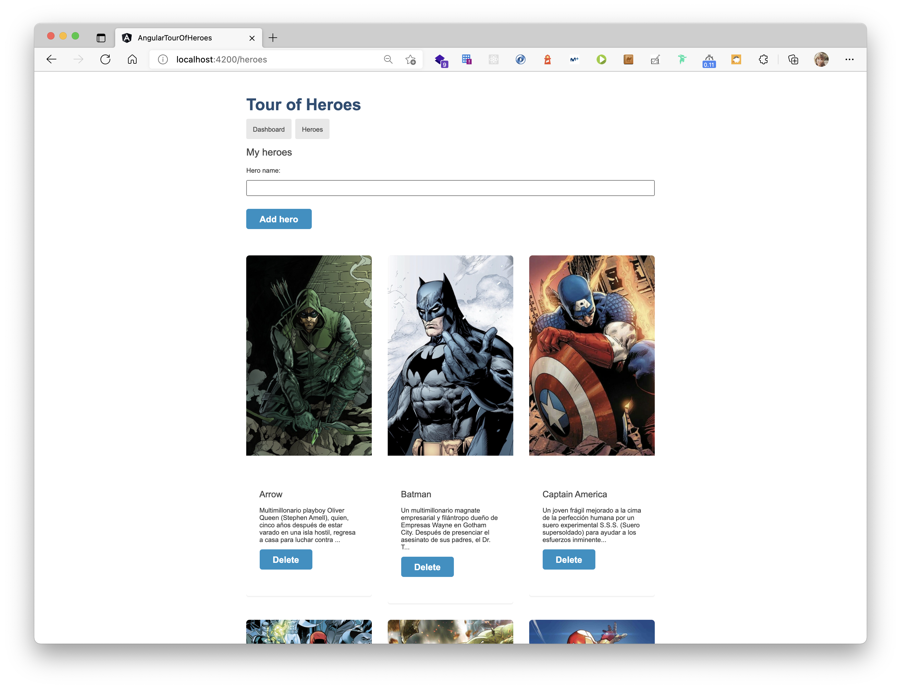

# Aplicación de ejemplo en Angular: Tour Of Heroes

En esta versión del proyecto, se añade imágenes a nuestros heroes. Se ha modificado el archivo app/heroes/heroes.component.html con lo siguiente:

```
<h2>My heroes</h2>
<div>
    <label for="new-hero">Hero name: </label>
    <input id="new-hero" #heroName />

    <!-- (click) passes input value to add() and the clears the input -->
    <button class="add-button" (click)="add(heroName.value); heroName.value=''">
        Add hero
    </button>
</div>
<!-- <ul class="heroes">
    <li *ngFor="let hero of heroes">
        
        <a routerLink=" /detail/{{hero.id}} ">
            <span class=" badge ">{{hero.id}}</span> {{hero.name}} </a>

        <button class=" delete " title=" delete hero " (click)=" delete(hero) ">x</button>
    </li>
</ul> -->
<div id="features-wrapper">
    <div class="container">
        <div class="row">
            <div class="col-4 col-12-medium" *ngFor="let hero of heroes">
                <!-- Box -->
                <section class="box feature">
                    <a routerLink="/detail/{{hero.id}}" class="image featured"></a>
                    <div class="inner">
                        <header>
                            <h2>{{hero.name}}</h2>
                        </header>
                        <p>{{hero.description | slice:0:150}}...</p>
                        <button (click)="delete(hero)"> Delete</button>
                    </div>
                </section>
            </div>
        </div>
    </div>
</div>
```

Se ha dejado comentado lo anterior para que se vea la diferencia.

También se ha modificado la página de detalle, en src/app/hero-detail/hero-detail.component.html para que se muestre el alter ego:

```
 <!-- <div *ngIf="hero">
    <h2>{{hero.name | uppercase}} Details</h2>
    <div><span>id: </span>{{hero.id}}</div>
    <div>
        <label for="hero-name">Hero name: </label>
        <input id="hero-name" [(ngModel)]="hero.name" placeholder="name">
    </div>
</div> -->
<div id="features-wrapper">
    <div class="container">
        <div class="row" *ngIf="hero">
            <div class="col-5 col-12-medium">
                <!-- Box -->
                <section class="box feature">
                    <a routerLink="/detail/{{hero.id}}" class="image featured"></a>
                </section>
            </div>
            <div class="col-7">
                <form>
                    <div class="form-group">
                        <label for="hero-name">
                            <input id="hero-name" [(ngModel)]="hero.name" [ngModelOptions]="{standalone: true}"
                                placeholder="Name">
                            <span>Hero name</span>
                        </label>
                    </div>
                    <div class="form-group">
                        <label for="hero-name">
                            <input id="hero-name" [(ngModel)]="hero.alterEgo" [ngModelOptions]="{standalone: true}"
                                placeholder="Alter ego">
                            <span>Alter ego</span>
                        </label>
                    </div>
                    <div class="form-group">
                        <label for="hero-name">
                            <textarea id="hero-description" [(ngModel)]="hero.description"
                                [ngModelOptions]="{standalone: true}" placeholder="Description"></textarea>
                            <span>Description</span>
                        </label>
                    </div>
                    <div class="buttons">
                        <button (click)="save()">Save</button>
                        <button (click)="goBack()">Go back</button>
                    </div>
                </form>
            </div>
        </div>
    </div>
</div>
```

Las imagenes están alojadas en el directorio **src/assets/heroes** y **src/assets/alteregos**.

## Cómo lo ejecuto

**IMPORTANTE**: Antes de ejecutar este proyecto necesitas tener la API en .NET ejecutándose. Más información [aquí](https://github.com/0GiS0/tour-of-heroes-dotnet-api)

Lo primero que debes hacer es descargarte el proyecto en local y apuntar al branch heroes-with-pics:

```
git clone https://github.com/0GiS0/tour-of-heroes-dotnet-api.git
git checkout heroes-with-pic
```

Instalar las dependencias con npm:

```
npm install
```

y por último ejecutarlo con start:

```
npm start
```

El proceso arrancará y estará disponible en esta dirección: [http://localhost:4200/](http://localhost:4200/)

## Resultado

El resultado de este cambio es el siguiente:


